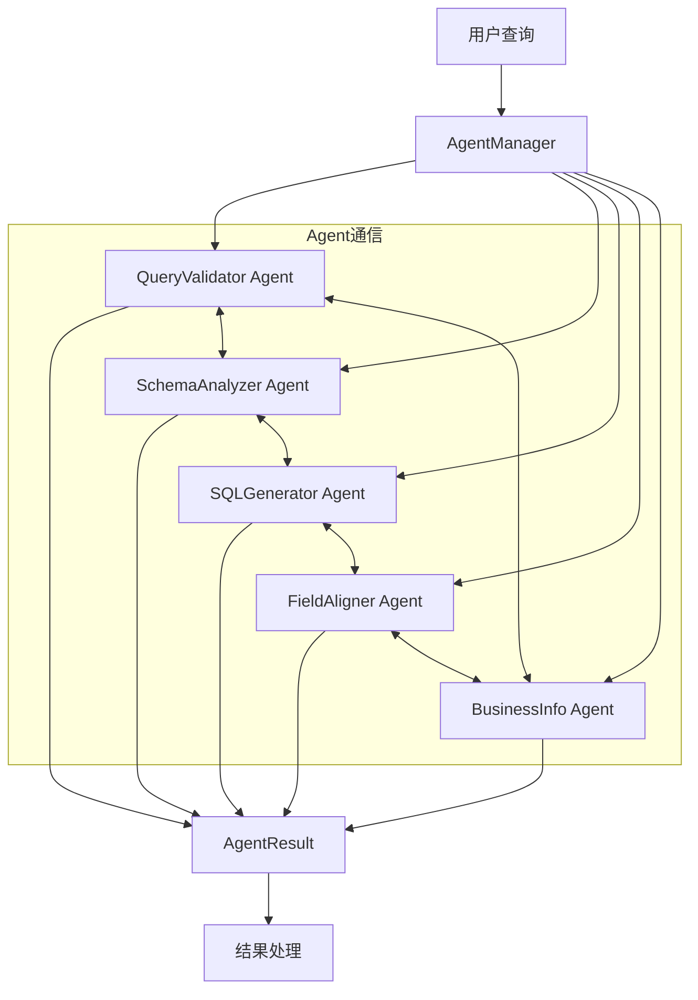
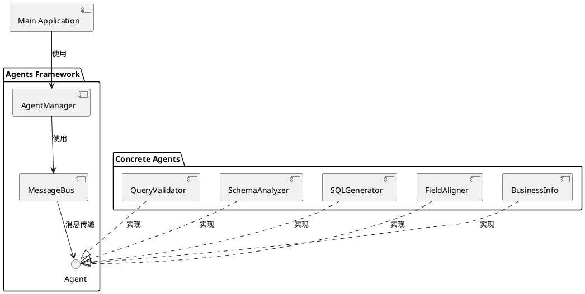
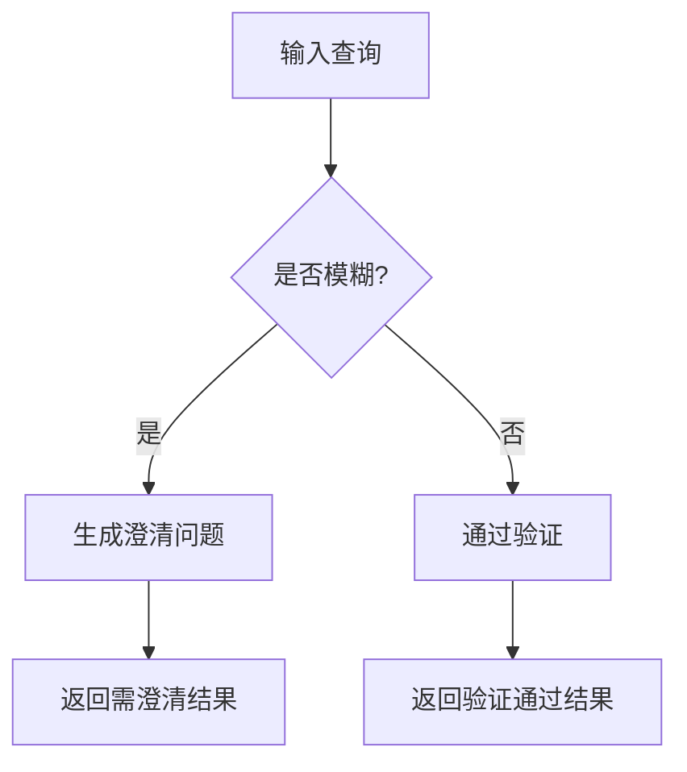
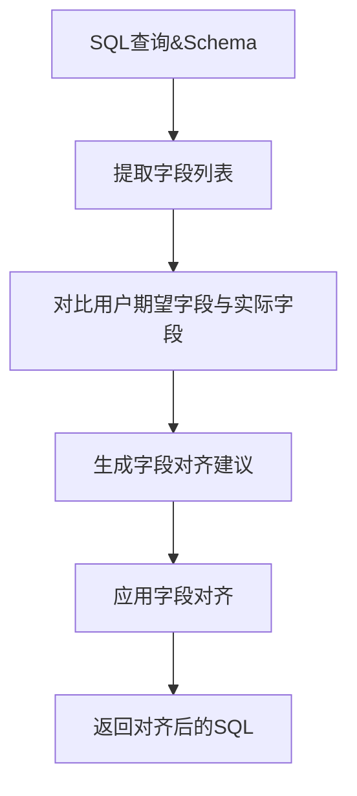
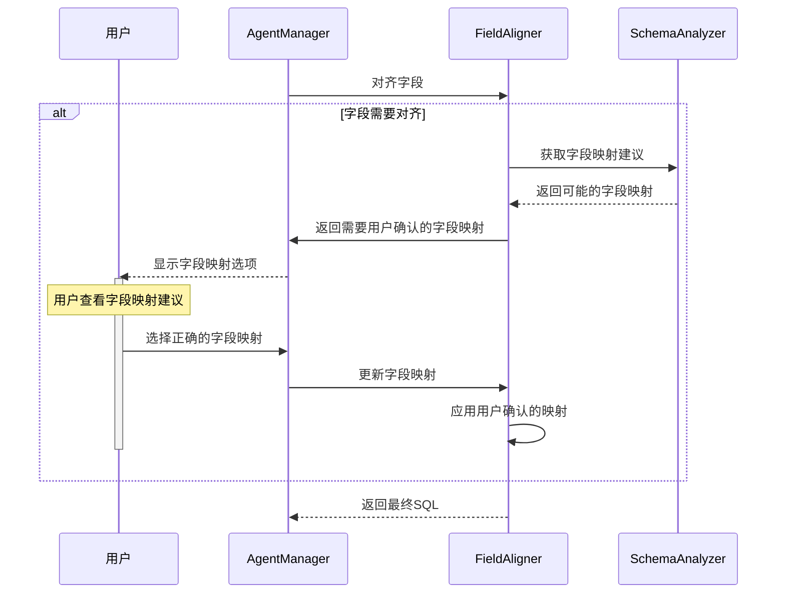
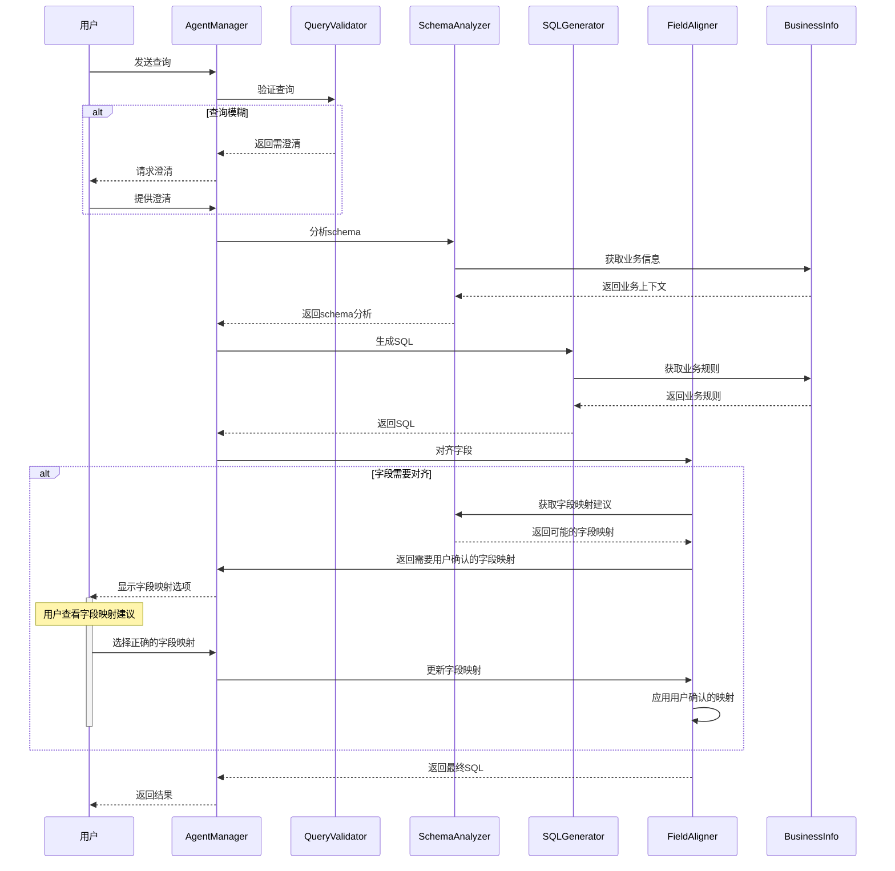
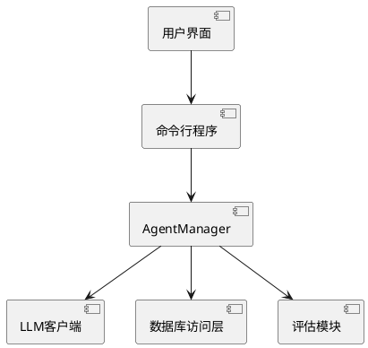

# GoSql Agents 设计方案

## 1. 总体架构

本文档描述了 GoSql 项目中基于 Agent 架构的设计方案，采用 MCP（Model-Controller-Presenter）架构实现单一职责和解耦。

### 1.1 架构图



### 1.2 组件关系



## 2. 目录结构

```
/home/zq/Projects/GoProjects/GoSql/
├── internal/
│   ├── agents/                     # 新增的agents目录
│   │   ├── base/                   # 基础接口和共享功能
│   │   │   ├── agent.go            # Agent接口定义
│   │   │   ├── context.go          # 上下文结构定义
│   │   │   └── message.go          # 消息定义
│   │   ├── query_validator/        # 查询验证agent
│   │   │   ├── validator.go        # 模糊查询验证器
│   │   │   ├── patterns.go         # 模糊模式匹配规则
│   │   │   └── clarifier.go        # 澄清问题生成器
│   │   ├── schema_analyzer/        # 模式分析agent
│   │   │   └── analyzer.go         # 数据库模式分析器
│   │   ├── sql_generator/          # SQL生成agent
│   │   │   └── generator.go        # SQL生成器
│   │   ├── field_aligner/          # 字段对齐agent
│   │   │   └── aligner.go          # 字段对齐器
│   │   ├── business_info/          # 业务信息agent
│   │   │   └── provider.go         # 业务信息提供器
│   │   ├── manager.go              # Agent管理器
│   │   └── registry.go             # Agent注册中心
│   └── ... (其他现有目录)
└── ... (其他项目文件)
```

## 3. 核心组件设计

### 3.1 Agent接口

所有agent都必须实现的基本接口：

```go
// Agent 定义了所有agents必须实现的基本接口
type Agent interface {
    // Execute 执行agent的主要功能
    Execute(ctx context.Context, input interface{}) AgentResult
    
    // GetName 返回agent的唯一名称
    GetName() string
    
    // GetDescription 返回agent的功能描述
    GetDescription() string
    
    // CanHandle 判断agent是否能处理给定的输入
    CanHandle(input interface{}) bool
}
```

### 3.2 AgentResult 结构

Agent执行后返回的标准结果结构：

```go
// AgentResult 表示agent执行结果
type AgentResult struct {
    Success     bool                     // 执行是否成功
    Data        interface{}              // 返回的数据
    Error       string                   // 错误信息
    NextActions []string                 // 建议的下一步操作
    Metadata    map[string]interface{}   // 元数据
}
```

### 3.3 消息总线

用于Agent之间的通信：

```go
// Message 定义了agent间通信的消息格式
type Message struct {
    From    string                  // 发送方
    To      string                  // 接收方
    Type    string                  // 消息类型
    Content interface{}             // 消息内容
}
```

## 4. 具体Agent实现

### 4.1 QueryValidator Agent



职责：
- 检测查询中的模糊表述
- 识别需要用户澄清的部分
- 生成有针对性的澄清问题
- 返回验证结果

### 4.2 FieldAligner Agent



职责：
- 分析查询中的字段与结果期望
- 与数据库schema进行对比
- 提供字段对齐的建议
- 调整SQL以反映正确的字段选择

### 4.3 FieldAligner Agent用户交互流程



### 4.4 BusinessInfo Agent

职责：
- 提供表和字段的业务含义
- 解释字段之间的关系
- 提供约束条件和业务规则
- 帮助正确理解查询意图

## 5. Agent间协作流程



## 6. 配置与扩展

### 6.1 配置文件

```yaml
# config/agents.yaml
agents:
  query_validator:
    enabled: true
    ambiguous_terms:
      - 特定
      - 某个
      - 指定
    # 更多配置...
  
  field_aligner:
    enabled: true
    # 配置...
  
  business_info:
    enabled: true
    table_info:
      employees:
        description: "员工信息表，存储所有员工的基本信息"
        fields:
          employee_id: "员工唯一标识符"
          name: "员工姓名"
          # 更多字段...
    # 更多表信息...
```

### 6.2 扩展机制

Agent系统设计为可扩展的，新的Agent只需要：

1. 实现Agent接口
2. 在AgentRegistry中注册
3. 提供相应的配置

## 7. 集成到现有系统



主要修改点：
1. 在cmd/predict/main.go中添加AgentManager的初始化
2. 在generateSQL函数中使用AgentManager处理查询
3. 为评估结果添加Agent处理的元数据

## 8. 安全与性能考虑

### 8.1 安全考虑
- 所有用户输入经过QueryValidator验证
- 敏感业务规则可以通过BusinessInfo Agent强制执行
- Agent执行有超时控制

### 8.2 性能优化
- Agent可并行执行
- 结果缓存机制
- 配置中可禁用不需要的Agent

## 9. 后续扩展计划

1. 添加ErrorAnalyzer Agent - 分析SQL执行错误
2. 添加SQLOptimizer Agent - 优化生成的SQL
3. 添加NLGenerator Agent - 将SQL结果转回自然语言
4. 添加HistoryTracker Agent - 跟踪查询历史和用户偏好
5. 添加LearningAgent - 从用户交互中学习改进
