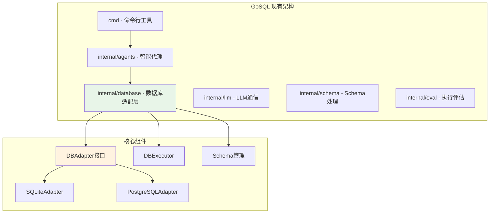
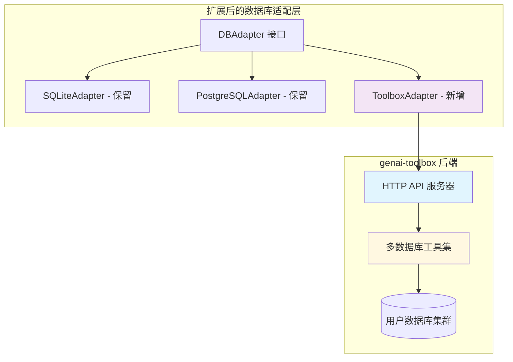
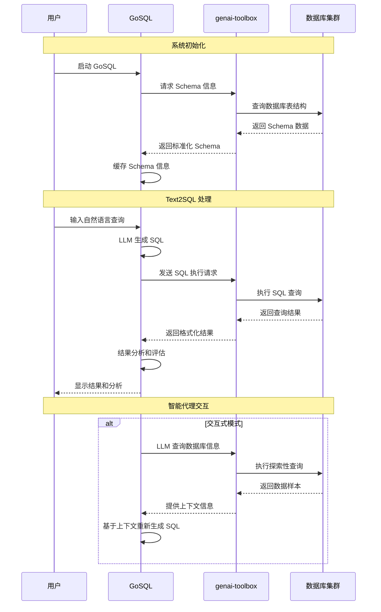

# GoSQL 与 genai-toolbox 集成方案

## 项目现状分析

### GoSQL 项目架构
基于您提供的代码，GoSQL 是一个完善的 Text2SQL 系统，具有以下特点：



**现有优势：**
- ✅ 完善的多数据库适配器架构 (SQLite, PostgreSQL)
- ✅ 智能代理系统，支持交互式 SQL 生成
- ✅ 多 LLM 模型支持 (OpenAI, DeepSeek, Gemini)
- ✅ 完整的结果分析和评估体系
- ✅ 中文优化的 Text2SQL 处理

**集成需求：**
- 🎯 扩展支持更多数据库类型 (15+ 种)
- 🎯 利用 genai-toolbox 的企业级特性
- 🎯 保持现有架构的完整性
- 🎯 最小化代码改动

## 集成策略

### 方案 A: 适配器扩展方案 (推荐)

在现有 `DBAdapter` 架构基础上，添加 genai-toolbox 适配器：



### 实现步骤

#### 1. 创建 ToolboxAdapter

```go
// internal/database/toolbox_adapter.go
package database

import (
    "bytes"
    "context"
    "encoding/json"
    "fmt"
    "net/http"
    "time"
    "database/sql"

    "github.com/zqzqsb/gosql/internal/dbmodel"
)

// ToolboxAdapter 基于 genai-toolbox 的数据库适配器
type ToolboxAdapter struct {
    baseURL    string
    httpClient *http.Client
    toolset    string
}

// ToolboxConfig genai-toolbox 配置
type ToolboxConfig struct {
    BaseDBConfig
    BaseURL     string `json:"base_url"`     // genai-toolbox 服务地址
    Toolset     string `json:"toolset"`     // 工具集名称
    DatabaseType string `json:"db_type"`    // 数据库类型
}

// NewToolboxAdapter 创建新的 toolbox 适配器
func NewToolboxAdapter(baseURL, toolset string) *ToolboxAdapter {
    return &ToolboxAdapter{
        baseURL: baseURL,
        toolset: toolset,
        httpClient: &http.Client{
            Timeout: 30 * time.Second,
        },
    }
}

// Connect 连接到 genai-toolbox (返回虚拟连接)
func (t *ToolboxAdapter) Connect(config DBConfig) (*sql.DB, error) {
    // genai-toolbox 管理连接，这里返回 nil 表示使用 HTTP API
    // 或创建一个虚拟的 sql.DB 以满足接口要求
    return nil, nil
}

// GetConnectionString 返回 toolbox 连接信息
func (t *ToolboxAdapter) GetConnectionString(config DBConfig) string {
    return fmt.Sprintf("toolbox://%s/%s", t.baseURL, t.toolset)
}

// AdaptSQL 处理 SQL 方言差异 (genai-toolbox 自动处理)
func (t *ToolboxAdapter) AdaptSQL(query string) string {
    return query // genai-toolbox 自动适配不同数据库的 SQL 方言
}

// LoadSchema 通过 genai-toolbox 加载数据库 Schema
func (t *ToolboxAdapter) LoadSchema(config DBConfig) (*dbmodel.DatabaseSchema, error) {
    toolboxConfig, ok := config.(*ToolboxConfig)
    if !ok {
        return nil, fmt.Errorf("配置类型错误，需要 ToolboxConfig")
    }
    
    // 调用 genai-toolbox 的 list_tables 工具
    response, err := t.invokeToolboxTool("list_tables", map[string]interface{}{
        "table_names": "", // 获取所有表
    })
    if err != nil {
        return nil, fmt.Errorf("获取 Schema 失败: %w", err)
    }
    
    // 解析响应并转换为 dbmodel.DatabaseSchema
    return t.parseSchemaResponse(response, toolboxConfig.DatabaseType)
}

// ExecuteSQL 通过 genai-toolbox 执行 SQL
func (t *ToolboxAdapter) ExecuteSQL(sql string) ([]map[string]interface{}, error) {
    response, err := t.invokeToolboxTool("execute_sql", map[string]interface{}{
        "statement": sql,
    })
    if err != nil {
        return nil, fmt.Errorf("SQL 执行失败: %w", err)
    }
    
    return t.parseExecutionResponse(response)
}

// invokeToolboxTool 调用 genai-toolbox 工具
func (t *ToolboxAdapter) invokeToolboxTool(toolName string, params map[string]interface{}) (map[string]interface{}, error) {
    url := fmt.Sprintf("%s/toolsets/%s/tools/%s/invoke", t.baseURL, t.toolset, toolName)
    
    jsonData, err := json.Marshal(params)
    if err != nil {
        return nil, err
    }
    
    req, err := http.NewRequest("POST", url, bytes.NewBuffer(jsonData))
    if err != nil {
        return nil, err
    }
    
    req.Header.Set("Content-Type", "application/json")
    
    resp, err := t.httpClient.Do(req)
    if err != nil {
        return nil, err
    }
    defer resp.Body.Close()
    
    if resp.StatusCode != http.StatusOK {
        return nil, fmt.Errorf("HTTP 错误: %d", resp.StatusCode)
    }
    
    var result map[string]interface{}
    if err := json.NewDecoder(resp.Body).Decode(&result); err != nil {
        return nil, err
    }
    
    return result, nil
}

// parseSchemaResponse 解析 Schema 响应
func (t *ToolboxAdapter) parseSchemaResponse(response map[string]interface{}, dbType string) (*dbmodel.DatabaseSchema, error) {
    content, ok := response["content"].([]interface{})
    if !ok {
        return nil, fmt.Errorf("无效的 Schema 响应格式")
    }
    
    schema := &dbmodel.DatabaseSchema{
        DatabaseName: "",
        Tables:       make(map[string]*dbmodel.Table),
    }
    
    for _, item := range content {
        tableData, ok := item.(map[string]interface{})
        if !ok {
            continue
        }
        
        tableName, ok := tableData["object_name"].(string)
        if !ok {
            continue
        }
        
        // 解析表详细信息
        tableDetails, ok := tableData["object_details"].(map[string]interface{})
        if !ok {
            continue
        }
        
        table := &dbmodel.Table{
            Name:    tableName,
            Columns: make([]*dbmodel.Column, 0),
        }
        
        // 解析列信息
        if columns, ok := tableDetails["columns"].([]interface{}); ok {
            for _, colData := range columns {
                if colMap, ok := colData.(map[string]interface{}); ok {
                    column := &dbmodel.Column{
                        Name:     colMap["column_name"].(string),
                        DataType: colMap["data_type"].(string),
                        Nullable: !colMap["is_not_nullable"].(bool),
                    }
                    table.Columns = append(table.Columns, column)
                }
            }
        }
        
        schema.Tables[tableName] = table
    }
    
    return schema, nil
}

// parseExecutionResponse 解析执行响应
func (t *ToolboxAdapter) parseExecutionResponse(response map[string]interface{}) ([]map[string]interface{}, error) {
    content, ok := response["content"].([]interface{})
    if !ok {
        return nil, fmt.Errorf("无效的执行响应格式")
    }
    
    results := make([]map[string]interface{}, 0, len(content))
    for _, item := range content {
        if row, ok := item.(map[string]interface{}); ok {
            results = append(results, row)
        }
    }
    
    return results, nil
}
```

#### 2. 扩展适配器工厂

```go
// internal/database/adapter.go (修改)
package database

import (
    "database/sql"
    "github.com/zqzqsb/gosql/internal/dbmodel"
)

// DBAdapter 数据库适配器接口
type DBAdapter interface {
    Connect(config DBConfig) (*sql.DB, error)
    GetConnectionString(config DBConfig) string
    AdaptSQL(query string) string
    LoadSchema(config DBConfig) (*dbmodel.DatabaseSchema, error)
    
    // 新增方法，支持直接执行 SQL (可选)
    ExecuteSQL(sql string) ([]map[string]interface{}, error)
}

// DBAdapterFactory 扩展工厂
type DBAdapterFactory struct {
    toolboxURL string
}

// NewDBAdapterFactory 创建工厂，支持 toolbox 配置
func NewDBAdapterFactory(toolboxURL string) *DBAdapterFactory {
    return &DBAdapterFactory{
        toolboxURL: toolboxURL,
    }
}

// CreateAdapter 支持更多数据库类型
func (f *DBAdapterFactory) CreateAdapter(dbType string) DBAdapter {
    switch dbType {
    case "sqlite", "sqlite3":
        return &SQLiteAdapter{}
    case "postgres", "postgresql":
        return &PostgreSQLAdapter{}
    case "toolbox":
        return NewToolboxAdapter(f.toolboxURL, "")
    case "mysql", "bigquery", "spanner", "redis", "neo4j":
        // 使用 toolbox 适配器处理新的数据库类型
        toolset := getToolsetForDBType(dbType)
        return NewToolboxAdapter(f.toolboxURL, toolset)
    default:
        // 默认尝试使用 toolbox
        return NewToolboxAdapter(f.toolboxURL, "")
    }
}

// getToolsetForDBType 根据数据库类型获取对应的工具集
func getToolsetForDBType(dbType string) string {
    toolsets := map[string]string{
        "mysql":     "mysql-database-tools",
        "bigquery":  "bigquery-tools", 
        "spanner":   "spanner-tools",
        "redis":     "redis-tools",
        "neo4j":     "neo4j-tools",
        "postgres":  "postgres-database-tools",
    }
    
    if toolset, exists := toolsets[dbType]; exists {
        return toolset
    }
    
    return "postgres-database-tools" // 默认工具集
}
```

#### 3. 扩展数据库配置

```go
// internal/database/config.go (扩展)

// ToolboxConfig genai-toolbox 配置
type ToolboxConfig struct {
    BaseDBConfig
    BaseURL      string `json:"base_url"`      // genai-toolbox 服务地址
    Toolset      string `json:"toolset"`      // 工具集名称
    DatabaseType string `json:"database_type"` // 实际数据库类型
}

// GetConnectionString 返回 toolbox 连接字符串
func (c *ToolboxConfig) GetConnectionString() string {
    return fmt.Sprintf("toolbox://%s/%s", c.BaseURL, c.Toolset)
}

// NewDBConfigFromPath 扩展支持 toolbox 配置
func NewDBConfigFromPath(path string) DBConfig {
    // 检查是否为 toolbox URL
    if strings.HasPrefix(path, "toolbox://") {
        return parseToolboxConfig(path)
    }
    
    // 检查是否需要使用 toolbox 适配的数据库类型
    if isToolboxSupportedDB(path) {
        return createToolboxConfig(path)
    }
    
    // 原有逻辑保持不变
    // ... 原有的 PostgreSQL 和 SQLite 逻辑
}

func parseToolboxConfig(url string) *ToolboxConfig {
    // 解析 toolbox://host:port/toolset 格式
    parts := strings.TrimPrefix(url, "toolbox://")
    urlParts := strings.Split(parts, "/")
    
    baseURL := "http://" + urlParts[0]
    toolset := ""
    if len(urlParts) > 1 {
        toolset = urlParts[1]
    }
    
    return &ToolboxConfig{
        BaseDBConfig: BaseDBConfig{
            Type:   "toolbox",
            DBName: "toolbox_db",
        },
        BaseURL:      baseURL,
        Toolset:      toolset,
        DatabaseType: "postgres", // 默认
    }
}

func isToolboxSupportedDB(path string) bool {
    supportedTypes := []string{"mysql:", "bigquery:", "spanner:", "redis:", "neo4j:"}
    for _, prefix := range supportedTypes {
        if strings.HasPrefix(path, prefix) {
            return true
        }
    }
    return false
}

func createToolboxConfig(path string) *ToolboxConfig {
    // 从路径中提取数据库类型
    dbType := strings.Split(path, ":")[0]
    
    return &ToolboxConfig{
        BaseDBConfig: BaseDBConfig{
            Type:   "toolbox",
            DBName: dbType + "_db",
        },
        BaseURL:      "http://localhost:5000", // 默认 toolbox 地址
        Toolset:      getToolsetForDBType(dbType),
        DatabaseType: dbType,
    }
}
```

#### 4. 修改执行器支持 toolbox

```go
// internal/database/executor.go (扩展)

// NewDBExecutor 支持 toolbox URL 配置
func NewDBExecutor(toolboxURL string) *DBExecutor {
    return &DBExecutor{
        factory: NewDBAdapterFactory(toolboxURL),
    }
}

// ExecSQL 扩展支持 toolbox 适配器
func (e *DBExecutor) ExecSQL(dbPath string, sqlQuery string) ([]map[string]interface{}, error) {
    ctx, cancel := context.WithTimeout(context.Background(), time.Minute)
    defer cancel()
    
    config := NewDBConfigFromPath(dbPath)
    adapter := e.factory.CreateAdapter(config.GetType())
    
    // 检查是否为 toolbox 适配器
    if toolboxAdapter, ok := adapter.(*ToolboxAdapter); ok {
        // 直接通过 HTTP API 执行，无需数据库连接
        return toolboxAdapter.ExecuteSQL(adapter.AdaptSQL(sqlQuery))
    }
    
    // 原有的数据库连接逻辑
    db, err := adapter.Connect(config)
    if err != nil {
        return nil, fmt.Errorf("数据库连接失败: %w", err)
    }
    defer db.Close()
    
    // 执行查询
    adaptedSQL := adapter.AdaptSQL(sqlQuery)
    rows, err := db.QueryContext(ctx, adaptedSQL)
    if err != nil {
        if ctx.Err() == context.DeadlineExceeded {
            return nil, fmt.Errorf("查询超时，超过1分钟: %w", err)
        }
        return nil, fmt.Errorf("SQL执行失败: %w", err)
    }
    defer rows.Close()
    
    return processQueryResults(rows)
}
```

### 方案 B: 配置驱动的集成方案

通过配置文件支持 genai-toolbox，无需修改核心代码：

#### 1. 扩展配置文件格式

```yaml
# configs/toolbox_config.yaml
database:
  type: "toolbox"
  toolbox:
    base_url: "http://localhost:5000"
    toolset: "postgres-database-tools"
    database_type: "postgres"
  
  # 或者直接使用 URL 格式
  connection_string: "toolbox://localhost:5000/postgres-database-tools"

llm:
  provider: "openai"
  model: "gpt-3.5-turbo"
  # ... 其他 LLM 配置
```

#### 2. 命令行使用示例

```bash
# 启动 genai-toolbox 服务器
./toolbox --prebuilt postgres --port 5000 &

# 使用 GoSQL 连接到 toolbox
go run cmd/predict/*.go \
  --config configs/llm_config.yaml \
  --dataset configs/datasets/spider.json \
  --db-path "toolbox://localhost:5000/postgres-database-tools" \
  --db-type toolbox \
  --interactive=true
```

### 集成效果图



## 实施计划

### 阶段 1: 基础集成 (1-2 周)
1. ✅ 实现 `ToolboxAdapter` 基础功能
2. ✅ 扩展 `DBAdapterFactory` 支持 toolbox
3. ✅ 修改配置解析支持 toolbox URL
4. ✅ 基本测试验证

### 阶段 2: 功能完善 (2-3 周)
1. ✅ 完善 Schema 解析和转换
2. ✅ 实现错误处理和重试机制
3. ✅ 添加连接池和缓存机制
4. ✅ 性能优化和并发支持

### 阶段 3: 高级特性 (2-3 周)
1. ✅ 集成 genai-toolbox 的监控和日志
2. ✅ 支持多数据库类型自动识别
3. ✅ 添加配置验证和健康检查
4. ✅ 完整的文档和示例

### 阶段 4: 生产就绪 (1-2 周)
1. ✅ 容器化部署配置
2. ✅ 性能测试和优化
3. ✅ 安全性加固
4. ✅ 部署文档和运维指南

## 部署架构

### 开发环境
```bash
# 启动 genai-toolbox
./toolbox --prebuilt postgres --port 5000

# 运行 GoSQL
go run cmd/predict/*.go --db-path "toolbox://localhost:5000/postgres-database-tools"
```

### 生产环境
```yaml
# docker-compose.yml
version: '3.8'
services:
  genai-toolbox:
    image: us-central1-docker.pkg.dev/database-toolbox/toolbox/toolbox:0.7.0
    ports:
      - "5000:5000"
    environment:
      - POSTGRES_HOST=${DB_HOST}
      - POSTGRES_PORT=${DB_PORT}
      - POSTGRES_DATABASE=${DB_NAME}
      - POSTGRES_USER=${DB_USER}
      - POSTGRES_PASSWORD=${DB_PASSWORD}
    command: ["--prebuilt", "postgres", "--address", "0.0.0.0", "--port", "5000"]
    
  gosql:
    build: .
    ports:
      - "8080:8080"
    depends_on:
      - genai-toolbox
    environment:
      - TOOLBOX_URL=http://genai-toolbox:5000
    volumes:
      - ./configs:/app/configs
      - ./data:/app/data
      - ./results:/app/results
```

## 优势总结

### 技术优势
1. **最小侵入**: 保持现有架构完整性，只添加新的适配器
2. **平滑迁移**: 现有 SQLite/PostgreSQL 功能不受影响
3. **扩展性强**: 轻松支持 15+ 种新数据库类型
4. **企业级**: 利用 genai-toolbox 的连接池、监控、安全特性

### 业务优势  
1. **功能保持**: 所有现有功能（交互式生成、结果分析）完全保留
2. **性能提升**: genai-toolbox 的连接池和优化机制
3. **运维友好**: 统一的数据库管理和监控
4. **成本降低**: 减少重复开发，专注核心 Text2SQL 逻辑

这个集成方案让您的 GoSQL 项目能够无缝利用 genai-toolbox 的强大数据库适配能力，同时保持现有投资的价值！ 