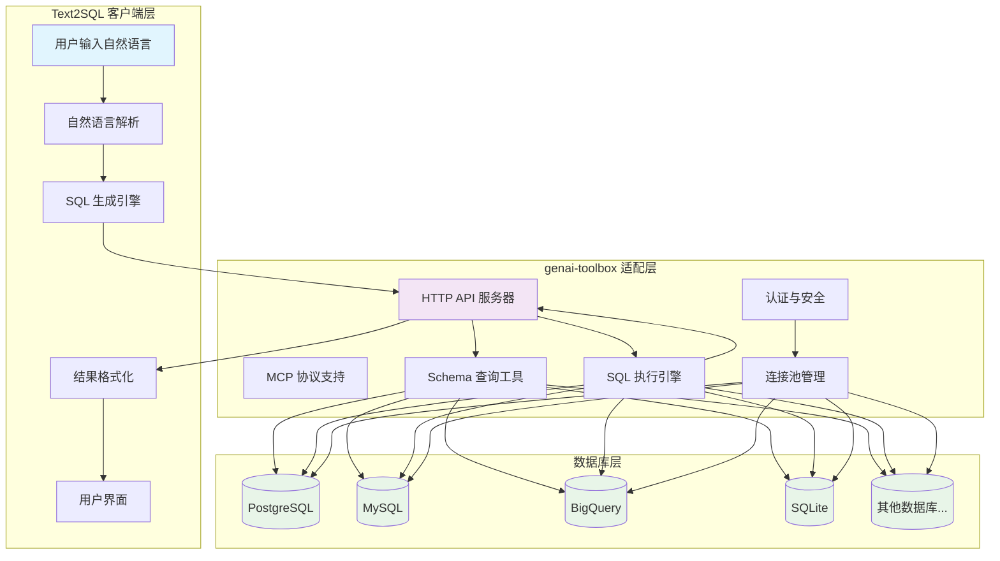
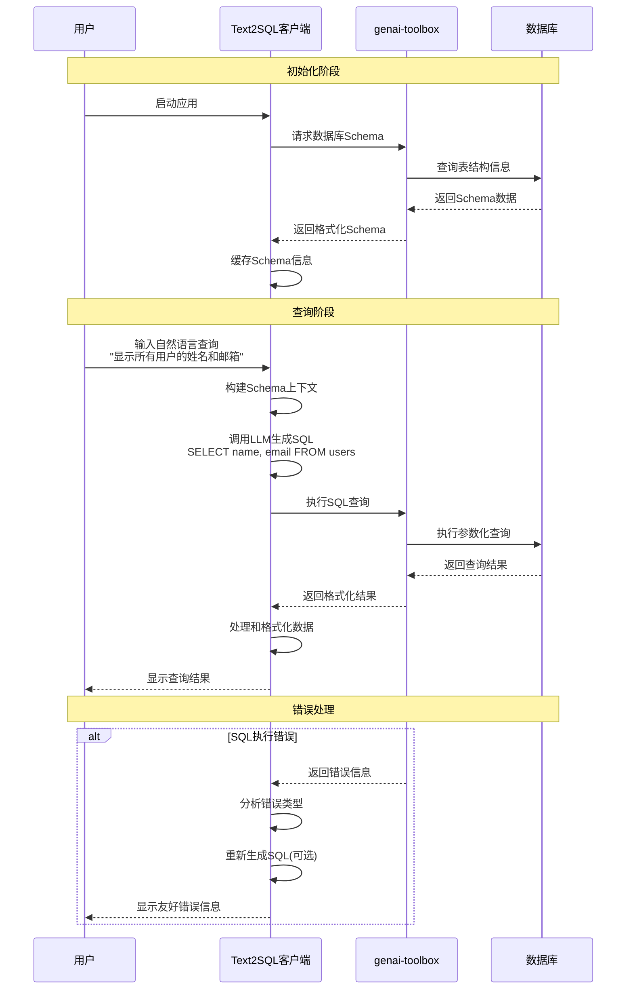
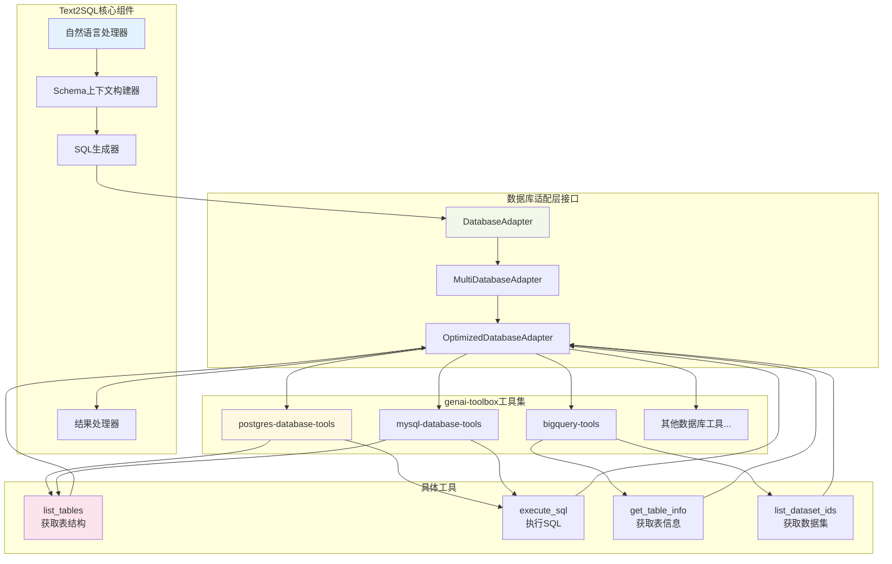
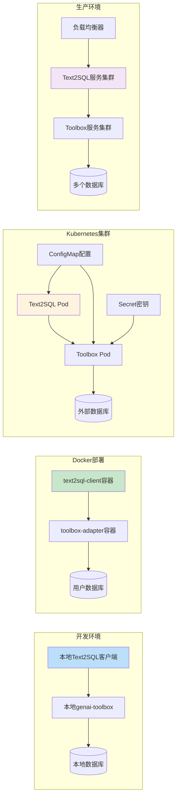

# 使用 genai-toolbox 作为 Text2SQL 数据库适配层

## 方案概述

genai-toolbox 非常适合作为 text2sql 客户端的数据库适配层，它可以提供：

- **统一的数据库接口**: 支持 15+ 种数据库类型
- **Schema 信息获取**: 动态获取表结构、字段信息
- **SQL 执行引擎**: 安全的 SQL 查询执行
- **连接管理**: 连接池、认证、重连机制
- **标准化 API**: HTTP 接口或 MCP 协议

## 架构设计

### 整体系统架构



### 数据流程图



## 核心功能实现

### 1. Schema 信息获取

genai-toolbox 提供了丰富的 schema 查询工具：

#### PostgreSQL Schema 查询
```yaml
# tools.yaml 配置
sources:
  user-database:
    kind: postgres  # 或 mysql, bigquery 等
    host: ${DB_HOST}
    port: ${DB_PORT}
    database: ${DB_NAME}
    user: ${DB_USER}
    password: ${DB_PASSWORD}

tools:
  get-table-schema:
    kind: postgres-sql
    source: user-database
    description: 获取数据库表结构信息
    statement: |
      SELECT 
        schemaname, tablename, 
        json_agg(json_build_object(
          'column_name', attname,
          'data_type', format_type(atttypid, atttypmod),
          'is_nullable', NOT attnotnull,
          'column_default', pg_get_expr(adbin, adrelid)
        ) ORDER BY attnum) as columns
      FROM pg_attribute att
      LEFT JOIN pg_attrdef ad ON att.attrelid = ad.adrelid AND att.attnum = ad.adnum
      JOIN pg_class cls ON att.attrelid = cls.oid
      JOIN pg_namespace ns ON cls.relnamespace = ns.oid
      WHERE att.attnum > 0 AND NOT att.attisdropped
        AND ns.nspname NOT IN ('pg_catalog', 'information_schema')
      GROUP BY schemaname, tablename;
```

#### 使用预构建工具 (推荐)
```bash
# 使用预构建的 PostgreSQL 配置
./toolbox --prebuilt postgres
```

预构建配置包含了完整的 schema 查询工具：
- `list_tables`: 获取所有表的详细结构信息
- `execute_sql`: 动态执行 SQL 查询

### 2. 客户端集成方案

#### 方案 A: HTTP API 集成 (推荐)

```python
# text2sql 客户端代码
import asyncio
import aiohttp
from typing import Dict, List, Any

class DatabaseAdapter:
    def __init__(self, toolbox_url: str = "http://localhost:5000"):
        self.toolbox_url = toolbox_url
        self.session = None
    
    async def __aenter__(self):
        self.session = aiohttp.ClientSession()
        return self
    
    async def __aexit__(self, exc_type, exc_val, exc_tb):
        if self.session:
            await self.session.close()
    
    async def get_database_schema(self) -> Dict[str, Any]:
        """获取数据库完整 schema"""
        async with self.session.post(
            f"{self.toolbox_url}/toolsets/postgres-database-tools/tools/list_tables/invoke",
            json={"table_names": ""}  # 空字符串获取所有表
        ) as response:
            result = await response.json()
            return self._parse_schema_result(result)
    
    async def execute_sql(self, sql: str, parameters: List[Any] = None) -> Dict[str, Any]:
        """执行 SQL 查询"""
        payload = {"statement": sql}
        if parameters:
            payload["parameters"] = parameters
            
        async with self.session.post(
            f"{self.toolbox_url}/toolsets/postgres-database-tools/tools/execute_sql/invoke",
            json=payload
        ) as response:
            return await response.json()
    
    def _parse_schema_result(self, result: Dict) -> Dict[str, Any]:
        """解析 schema 结果为标准格式"""
        schema_info = {
            "tables": {},
            "database_type": "postgresql"  # 根据实际类型调整
        }
        
        for row in result.get("content", []):
            table_name = row["object_name"]
            table_details = row["object_details"]
            
            schema_info["tables"][table_name] = {
                "columns": table_details["columns"],
                "constraints": table_details["constraints"],
                "indexes": table_details["indexes"]
            }
        
        return schema_info

# Text2SQL 主要逻辑
class Text2SQLClient:
    def __init__(self, db_adapter: DatabaseAdapter):
        self.db_adapter = db_adapter
        self.schema_cache = None
    
    async def initialize(self):
        """初始化，获取数据库 schema"""
        self.schema_cache = await self.db_adapter.get_database_schema()
    
    async def natural_language_to_sql(self, question: str) -> str:
        """将自然语言转换为 SQL"""
        # 使用 schema_cache 中的信息生成 SQL
        # 这里集成您的 LLM 或规则引擎
        context = self._build_schema_context()
        
        prompt = f"""
        基于以下数据库结构回答问题：
        {context}
        
        问题：{question}
        
        请生成相应的 SQL 查询：
        """
        
        # 调用您的 LLM 服务
        sql = await self._call_llm(prompt)
        return sql
    
    async def execute_and_format_result(self, sql: str) -> Dict[str, Any]:
        """执行 SQL 并格式化结果"""
        result = await self.db_adapter.execute_sql(sql)
        return self._format_result(result)
    
    def _build_schema_context(self) -> str:
        """构建 schema 上下文信息"""
        context = "数据库表结构：\n"
        for table_name, table_info in self.schema_cache["tables"].items():
            context += f"\n表名: {table_name}\n"
            context += "字段:\n"
            for column in table_info["columns"]:
                context += f"  - {column['column_name']}: {column['data_type']}\n"
        return context

# 使用示例
async def main():
    async with DatabaseAdapter() as db_adapter:
        client = Text2SQLClient(db_adapter)
        await client.initialize()
        
        # 自然语言查询
        question = "显示所有用户的姓名和邮箱"
        sql = await client.natural_language_to_sql(question)
        result = await client.execute_and_format_result(sql)
        
        print(f"生成的 SQL: {sql}")
        print(f"查询结果: {result}")

if __name__ == "__main__":
    asyncio.run(main())
```

#### 方案 B: MCP 协议集成

```python
# 使用 toolbox-core SDK
from toolbox_core import ToolboxClient
import asyncio

class MCPDatabaseAdapter:
    def __init__(self, toolbox_url: str = "http://localhost:5000"):
        self.toolbox_url = toolbox_url
        self.client = None
        self.tools = None
    
    async def initialize(self):
        """初始化 MCP 连接"""
        self.client = ToolboxClient(self.toolbox_url)
        await self.client.__aenter__()
        self.tools = await self.client.load_toolset("postgres-database-tools")
    
    async def get_schema(self):
        """获取数据库 schema"""
        result = await self.tools["list_tables"].invoke({"table_names": ""})
        return result
    
    async def execute_sql(self, sql: str):
        """执行 SQL"""
        result = await self.tools["execute_sql"].invoke({"statement": sql})
        return result
    
    async def close(self):
        """关闭连接"""
        if self.client:
            await self.client.__aexit__(None, None, None)
```

### 3. 多数据库支持策略

#### 动态配置支持
```python
class MultiDatabaseAdapter:
    """支持多种数据库的适配器"""
    
    DATABASE_CONFIGS = {
        "postgresql": {
            "toolset": "postgres-database-tools",
            "prebuilt": "postgres"
        },
        "mysql": {
            "toolset": "mysql-database-tools", 
            "prebuilt": "cloud-sql-mysql"
        },
        "bigquery": {
            "toolset": "bigquery-tools",
            "prebuilt": "bigquery"
        }
    }
    
    def __init__(self, database_type: str, connection_params: Dict):
        self.db_type = database_type
        self.connection_params = connection_params
        self.config = self.DATABASE_CONFIGS.get(database_type)
        
        if not self.config:
            raise ValueError(f"不支持的数据库类型: {database_type}")
    
    async def start_toolbox_server(self):
        """启动对应的 toolbox 服务器"""
        import subprocess
        import os
        
        # 设置环境变量
        env = os.environ.copy()
        for key, value in self.connection_params.items():
            env[f"{self.db_type.upper()}_{key.upper()}"] = value
        
        # 启动 toolbox 服务器
        cmd = [
            "./toolbox", 
            "--prebuilt", self.config["prebuilt"],
            "--port", "5000"
        ]
        
        self.server_process = subprocess.Popen(cmd, env=env)
        
        # 等待服务器启动
        await asyncio.sleep(3)
    
    def get_schema_tools(self) -> List[str]:
        """获取 schema 查询工具列表"""
        schema_tools = {
            "postgresql": ["list_tables"],
            "mysql": ["list_tables"], 
            "bigquery": ["list_dataset_ids", "list_table_ids", "get_table_info"]
        }
        return schema_tools.get(self.db_type, ["list_tables"])
```

### 4. 完整的集成配置

#### 组件架构图



#### 部署架构图



#### Docker Compose 部署
```yaml
# docker-compose.yml
version: '3.8'
services:
  toolbox-adapter:
    image: us-central1-docker.pkg.dev/database-toolbox/toolbox/toolbox:0.7.0
    ports:
      - "5000:5000"
    environment:
      - POSTGRES_HOST=${DB_HOST}
      - POSTGRES_PORT=${DB_PORT}
      - POSTGRES_DATABASE=${DB_NAME}
      - POSTGRES_USER=${DB_USER}
      - POSTGRES_PASSWORD=${DB_PASSWORD}
    command: ["--prebuilt", "postgres", "--address", "0.0.0.0", "--port", "5000"]
    
  text2sql-client:
    build: .
    ports:
      - "8080:8080"
    depends_on:
      - toolbox-adapter
    environment:
      - TOOLBOX_URL=http://toolbox-adapter:5000
```

#### 配置管理
```python
# config.py
from dataclasses import dataclass
from typing import Dict, Any
import os

@dataclass
class DatabaseConfig:
    host: str
    port: int
    database: str
    user: str
    password: str
    db_type: str
    
    @classmethod
    def from_env(cls, db_type: str = "postgresql"):
        """从环境变量创建配置"""
        return cls(
            host=os.getenv("DB_HOST", "localhost"),
            port=int(os.getenv("DB_PORT", "5432")),
            database=os.getenv("DB_NAME"),
            user=os.getenv("DB_USER"),
            password=os.getenv("DB_PASSWORD"),
            db_type=db_type
        )
    
    def to_toolbox_env(self) -> Dict[str, str]:
        """转换为 toolbox 环境变量格式"""
        prefix = self.db_type.upper()
        return {
            f"{prefix}_HOST": self.host,
            f"{prefix}_PORT": str(self.port),
            f"{prefix}_DATABASE": self.database,
            f"{prefix}_USER": self.user,
            f"{prefix}_PASSWORD": self.password
        }
```

## 实施步骤

### 1. 环境搭建
```bash
# 下载 toolbox
curl -O https://storage.googleapis.com/genai-toolbox/v0.7.0/linux/amd64/toolbox
chmod +x toolbox

# 设置数据库环境变量
export POSTGRES_HOST=your_db_host
export POSTGRES_PORT=5432
export POSTGRES_DATABASE=your_db_name
export POSTGRES_USER=your_user
export POSTGRES_PASSWORD=your_password

# 启动适配层服务
./toolbox --prebuilt postgres --port 5000
```

### 2. 集成验证
```python
# test_integration.py
async def test_database_adapter():
    async with DatabaseAdapter() as adapter:
        # 测试 schema 获取
        schema = await adapter.get_database_schema()
        print("Schema:", schema)
        
        # 测试 SQL 执行
        result = await adapter.execute_sql("SELECT COUNT(*) FROM information_schema.tables")
        print("Table count:", result)

asyncio.run(test_database_adapter())
```

### 3. 性能优化
```python
class OptimizedDatabaseAdapter(DatabaseAdapter):
    def __init__(self, *args, **kwargs):
        super().__init__(*args, **kwargs)
        self.schema_cache = None
        self.cache_ttl = 300  # 5分钟缓存
        self.last_cache_time = 0
    
    async def get_database_schema(self, force_refresh: bool = False):
        """带缓存的 schema 获取"""
        import time
        
        current_time = time.time()
        if (not force_refresh and 
            self.schema_cache and 
            current_time - self.last_cache_time < self.cache_ttl):
            return self.schema_cache
        
        self.schema_cache = await super().get_database_schema()
        self.last_cache_time = current_time
        return self.schema_cache
```

## 优势总结

1. **开箱即用**: 无需自己实现数据库连接和 SQL 执行逻辑
2. **多数据库支持**: 统一接口支持 15+ 种数据库
3. **企业级特性**: 连接池、认证、监控、日志
4. **标准化接口**: HTTP API 或 MCP 协议
5. **可扩展性**: 支持自定义工具和配置
6. **生产就绪**: 支持 Docker、Kubernetes 部署

这个方案可以让您专注于核心的自然语言理解和 SQL 生成逻辑，而将复杂的数据库适配工作交给 genai-toolbox 处理。
