# Text-to-SQL 的问题与挑战

## 1. 缺乏业务上下文

- **业务术语理解**：模型难以理解特定领域的专业术语和概念，导致无法正确映射到数据库架构。
- **表/列的业务含义理解**：数据库中的表名和列名通常使用技术命名，与自然语言中的业务描述存在差异。
- **错别字/同义词**：用户输入可能包含错别字或使用同义词，模型需要理解这些变体。
- **需要逻辑推理**：某些查询需要基于业务规则进行逻辑推理，而不仅仅是简单的语义匹配。
- **问题不完整**：用户提问可能省略了关键信息，需要模型根据上下文补全。
- **问题含义模糊**：自然语言问题可能存在多种解释，导致SQL生成不确定。
- **问题自带歧义**：某些问题本身就包含语义歧义，需要进一步澄清。
- **代指信息**：问题中可能包含代词或指代词，模型需要正确解析指代对象。
- **省略信息**：用户可能省略了某些查询条件，模型需要判断是否需要补充。

## 2. 自然语言本身的复杂性

- **问题不完整**：用户提问常常省略关键信息，需要模型根据上下文进行补全。
- **问题含义模糊**：自然语言表达可能存在多种解释，导致SQL生成结果不确定。
- **问题自带歧义**：某些问题本身就包含语义歧义，需要进一步澄清。
- **代指信息**：问题中包含的代词或指代词需要正确解析。
- **省略信息**：用户可能省略某些查询条件，模型需要判断是否需要补充。

## 3. 数据库的复杂性

- **大量的数据库表/列**：真实数据库可能包含大量表和列，增加了映射难度。
- **严格的语法规则**：SQL语法严格，模型需要生成符合语法规范的查询语句。
- **数据库类型多样性**：不同数据库系统（如MySQL、PostgreSQL）有不同的SQL方言和特性。

## 4. 模型生成的结果有随机性

- **模型不按指令生成SQL**：大语言模型可能偏离指令，生成非SQL内容。
- **模型生成的SQL有错误**：生成的SQL可能包含语法错误或逻辑错误。
- **依赖数据库Dialect**：不同数据库系统的SQL语法有差异，模型需要适应不同方言。
- **需要使用高级函数**：复杂查询可能需要使用高级SQL函数，这对模型是一个挑战。

## 5. 复杂的查询

- **join大量的表**：复杂查询可能需要连接多个表，增加了生成难度。
- **大量的嵌套查询**：嵌套子查询增加了SQL的复杂性和生成难度。

## 核心解决方案

针对Text-to-SQL任务的挑战，有几种核心解决方案：

### 特定于Text-to-SQL相关的核心方案

1. **RAG（检索增强生成）**：利用知识工程技术，从相关资源中检索信息辅助SQL生成。
2. **Schema Linking**：实现自然语言与数据库模式之间的精确映射。
3. **推理增强**：增强模型的逻辑推理能力，处理复杂查询。
4. **Revise Agent**：引入修订代理，对生成的SQL进行检查和优化。

### 通用LLM应用相关的方案

1. **上下文理解**：提升模型对上下文的理解能力。
2. **微调模型**：针对特定任务对模型进行微调。
3. **提供Example**：通过示例学习提高模型性能。
4. **密集检索**：增强模型的信息检索能力。

## 架构设计

为了应对上述挑战，Text-to-SQL系统的架构设计需要考虑以下方面：

1. **模块化设计**：将系统分解为独立的功能模块，便于维护和升级。
2. **可插拔组件**：支持不同的LLM模型、Schema加载方式和提示词模板。
3. **错误处理机制**：检测并处理SQL生成过程中的错误。
4. **反馈循环**：收集用户反馈，持续改进模型性能。
5. **多样化评估**：使用多种指标评估系统性能，不仅关注SQL语法正确性，还关注查询结果的准确性。

通过综合应用这些解决方案和架构设计原则，可以有效提升Text-to-SQL系统的性能和用户体验。

## Text-to-SQL 挑战与解决方案图

```mermaid
graph TD
    %% 定义主要分类
    Challenge1[缺乏业务上下文] ---|问题分解| Solution1
    Challenge2[自然语言本身的复杂性] ---|问题分解| Solution1
    Challenge3[数据库的复杂性] ---|问题分解| Solution1
    Challenge4[模型有幻觉] ---|问题分解| Solution1
    Challenge5[复杂的查询] ---|问题分解| Solution1
    
    %% 问题分解区域
    subgraph 问题分解
        C1_1[业务术语理解] --> Solution1
        C1_2[表/列的业务含义理解] --> Solution1
        C1_3[错别字/同义词] --> Solution1
        C1_4[需要逻辑推理] --> Solution1
        C1_5[问题不完整] --> Solution1
        C1_6[问题含义模糊] --> Solution1
        C1_7[问题自带歧义] --> Solution1
        C1_8[代指信息] --> Solution1
        C1_9[省略信息] --> Solution1
        
        C2_5[大量的数据库表/列] --> Solution1
        C2_6[严格的语法规则] --> Solution1
        C2_7[数据库类型多样性] --> Solution1
        
        C3_1[模型不按指令生成SQL] --> Solution1
        C3_2[模型生成的SQL有错误] --> Solution1
        C3_3[依赖数据库Dialect] --> Solution1
        C3_4[需要使用高级函数] --> Solution1
        
        C4_1[join大量的表] --> Solution1
        C4_2[大量的嵌套查询] --> Solution1
    end
    
    %% 解决方案区域
    subgraph 应用方案
        Solution1 --> S1[RAG]
        Solution1 --> S2[Schema Linking]
        Solution1 --> S3[推理增强]
        Solution1 --> S4[Revise Agent]
    end
    
    %% 核心能力区域
    subgraph 核心能力
        S1 --> Core1[知识工程]
        S2 --> Core2[架构设计]
        S3 --> Core2
        S4 --> Core2
    end
    
    %% 通用LLM应用方案
    subgraph 通用LLM应用相关的方案
        Core2 --> G1[上下文理解]
        Core2 --> G2[微调模型]
        Core2 --> G3[提供Example]
        Core2 --> G4[密集检索]
    end
    
    %% 样式设置
    classDef challenge fill:#e6f7ff,stroke:#1890ff,stroke-width:1px
    classDef solution fill:#f6ffed,stroke:#52c41a,stroke-width:1px
    classDef core fill:#fff2e8,stroke:#fa8c16,stroke-width:1px
    classDef special fill:#fff1f0,stroke:#ff4d4f,stroke-width:1px
    
    class Challenge1,Challenge2,Challenge3,Challenge4,Challenge5 challenge
    class S1,S2,S3,S4 solution
    class Core1,Core2 core
    class G1,G2,G3,G4 special
    
    %% 特定于Text-to-SQL相关标注
    S1 -.-> |特定于Text-to-SQL相关的核心方案| Core1
    S2 -.-> |特定于Text-to-SQL相关的核心方案| Core2
    S3 -.-> |特定于Text-to-SQL相关的核心方案| Core2
    S4 -.-> |特定于Text-to-SQL相关的核心方案| Core2
```

