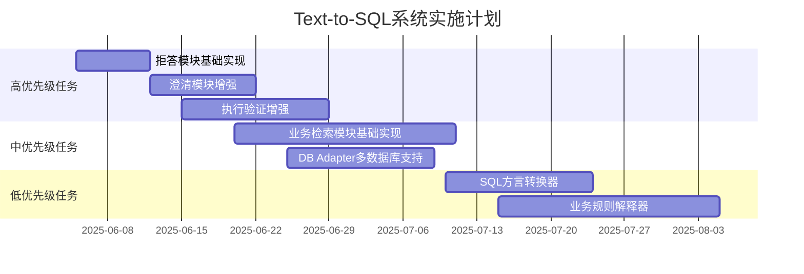
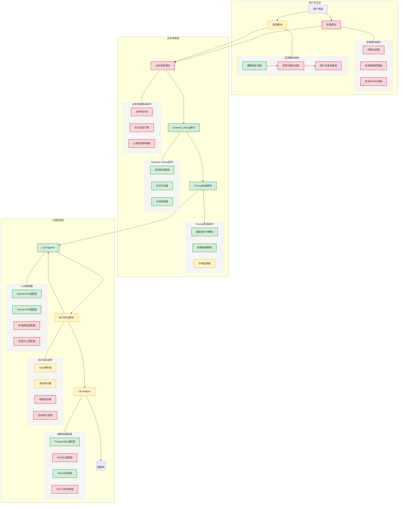

# Text-to-SQL 系统各模块实施情况

## 1. 当前实施状态概览

根据项目结构和完整系统设计文档，以下是当前各模块的实施状态图：

```mermaid
graph TD
    %% 核心模块
    subgraph 已实现模块
        A1[Schema Linking模块] --> |已实现| A1_1[Schema加载器]
        A2[Prompt构造模块] --> |已实现| A2_1[提示词模板]
        A3[LLM Agents] --> |已实现| A3_1[多种LLM接口]
        A4[DB Adapter] --> |部分实现| A4_1[PostgreSQL适配]
        A5[澄清模块] --> |部分实现| A5_1[模糊查询检测]
        A6[执行验证模块] --> |部分实现| A6_1[SQL执行器]
    end
    
    subgraph 待实现模块
        B1[拒答模块] --> |待实现| B1_1[内容过滤器]
        B1 --> |待实现| B1_2[拒绝策略管理器]
        B1 --> |待实现| B1_3[安全日志记录器]
        
        B2[澄清模块增强] --> |待实现| B2_1[澄清问题生成器]
        B2 --> |待实现| B2_2[用户反馈收集器]
        
        B3[业务检索模块] --> |待实现| B3_1[业务知识库]
        B3 --> |待实现| B3_2[语义匹配引擎]
        B3 --> |待实现| B3_3[业务规则解释器]
        
        B4[DB Adapter增强] --> |待实现| B4_1[多数据库支持]
        B4 --> |待实现| B4_2[SQL方言转换器]
        
        B5[执行验证增强] --> |待实现| B5_1[结果验证器]
        B5 --> |待实现| B5_2[自动修正机制]
    end
    
    %% 连接关系
    A1 -.-> B3
    A5 -.-> B2
    A4 -.-> B4
    A6 -.-> B5
    
    %% 样式
    classDef implemented fill:#d4edda,stroke:#28a745,stroke-width:2px;
    classDef partial fill:#fff3cd,stroke:#ffc107,stroke-width:2px;
    classDef pending fill:#f8d7da,stroke:#dc3545,stroke-width:2px;
    
    class A1,A2,A3 implemented;
    class A4,A5,A6 partial;
    class B1,B2,B3,B4,B5 pending;
```

## 2. 已实现模块详情

### 2.1 Schema Linking模块

**实现程度**: ✅ 完全实现

**关键组件**:
- Schema加载器: 支持从数据库中加载表结构、列信息和关系
- 实体识别与映射: 能够将自然语言查询中的实体映射到数据库schema

**代码位置**: `/home/zq/Projects/GoProjects/GoSql/internal/schema`

### 2.2 Prompt构造模块

**实现程度**: ✅ 完全实现

**关键组件**:
- 提示词模板: 支持多种提示词模板，包括基本模板和带推理过程的模板
- 上下文整合: 将schema信息和查询整合到提示词中

**代码位置**: `/home/zq/Projects/GoProjects/GoSql/cmd/predict/generator.go`

### 2.3 LLM Agents

**实现程度**: ✅ 完全实现

**关键组件**:
- 多种LLM接口: 支持多种大语言模型，如OpenAI、Claude等
- 请求管理: 处理对LLM的请求和响应

**代码位置**: `/home/zq/Projects/GoProjects/GoSql/internal/llm`

### 2.4 DB Adapter

**实现程度**: ⚠️ 部分实现

**关键组件**:
- PostgreSQL适配: 支持PostgreSQL数据库的连接和查询
- SQLite支持: 基本支持SQLite数据库

**代码位置**: `/home/zq/Projects/GoProjects/GoSql/internal/database`

**待实现**:
- 多数据库支持: 扩展对更多数据库类型的支持
- SQL方言转换: 在不同数据库方言之间转换SQL

### 2.5 澄清模块

**实现程度**: ⚠️ 部分实现

**关键组件**:
- 模糊查询检测: 能够检测模糊或不明确的查询

**代码位置**: `/home/zq/Projects/GoProjects/GoSql/cmd/predict/generator.go`

**待实现**:
- 澄清问题生成: 自动生成针对性的澄清问题
- 用户反馈收集: 收集和处理用户的澄清信息

### 2.6 执行验证模块

**实现程度**: ⚠️ 部分实现

**关键组件**:
- SQL执行器: 能够执行生成的SQL查询

**代码位置**: `/home/zq/Projects/GoProjects/GoSql/internal/database`

**待实现**:
- 结果验证: 验证查询结果是否符合预期
- 自动修正: 在查询错误时自动请求修正

## 3. 待实现模块详情

### 3.1 拒答模块

**实现优先级**: 🔴 高

**关键组件**:
- 内容过滤器: 检测查询中的敏感词汇和有害内容
- 拒绝策略管理器: 定义如何优雅地拒绝不适当请求
- 安全日志记录器: 记录被拒绝的请求

**实现建议**:
- 可以利用现有LLM的内容过滤能力
- 建立敏感词汇库和拒绝回答模板

### 3.2 业务检索模块

**实现优先级**: 🟠 中

**关键组件**:
- 业务知识库: 存储业务规则、术语和业务流程
- 语义匹配引擎: 将查询与业务概念匹配
- 业务规则解释器: 应用业务规则解释查询

**实现建议**:
- 构建业务术语表和规则库
- 使用向量数据库存储业务知识
- 实现RAG(检索增强生成)机制

## 4. 近期任务规划

## 5. 模块间交互和依赖关系

## 6. 总结与下一步建议

当前Text-to-SQL系统已经实现了核心的SQL生成功能，包括Schema Linking、提示词构造和LLM交互等关键模块。系统能够基于自然语言查询和数据库结构生成SQL语句，并支持基本的模糊查询检测。

**下一步优先实施建议**:

1. **拒答模块**: 增强系统安全性，防止生成有害或敏感内容
2. **澄清模块增强**: 提高系统处理不明确查询的能力，改善用户体验
3. **执行验证增强**: 确保生成的SQL正确可执行，并能自动修正错误
4. **业务检索模块**: 增强系统对业务上下文的理解能力

这些改进将使系统更加健壮、安全，并能更好地理解和满足用户的查询需求。