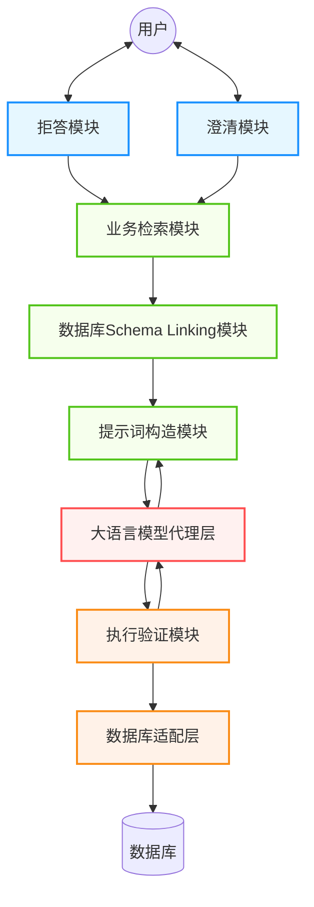
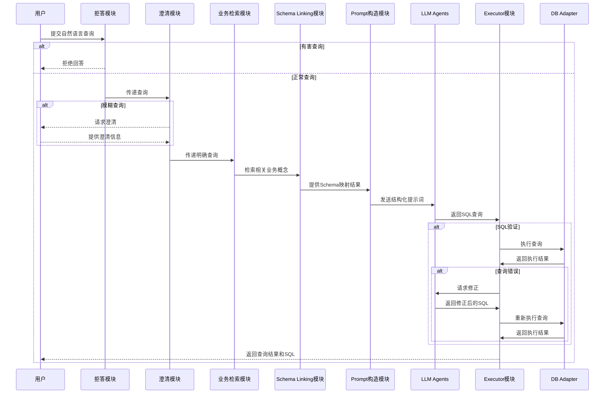

# Text-to-SQL 完整系统设计

## 1. 系统概述

Text-to-SQL系统旨在将自然语言查询转换为结构化的SQL查询语句，使非技术用户能够便捷地与数据库交互。本设计文档提出了一个模块化、可扩展的系统架构，旨在解决Text-to-SQL任务中的各种挑战。

### 1.1 系统架构图

### 1.2 模块交互流程图

## 2. 核心模块说明

### 2.1 拒答模块

**功能描述**：负责识别并拒绝回答有害、敏感或不适当的查询。

**关键组件**：
- 内容过滤器：检测查询中的敏感词汇、有害内容或不适当请求
- 拒绝策略管理器：定义如何优雅地拒绝不适当请求
- 安全日志记录器：记录被拒绝的请求以便后续分析

### 2.2 澄清模块

**功能描述**：识别模糊或不完整的查询，并向用户请求澄清。

**关键组件**：
- 模糊性检测器：识别查询中的模糊或多义表达
- 澄清问题生成器：生成针对性的澄清问题
- 用户反馈收集器：收集用户的澄清信息

### 2.3 业务检索模块

**功能描述**：将查询信息与具体业务逻辑进行关联，不直接面向用户。

**关键组件**：
- 业务知识库：存储业务规则、术语和业务流程
- 语义匹配引擎：将自然语言查询与业务概念进行匹配
- 业务规则解释器：应用业务规则对查询进行解释

### 2.4 Schema Linking模块

**功能描述**：识别和提取与查询相关的数据库schema信息。

**关键组件**：
- Schema加载器：加载数据库结构信息
- 实体识别器：从自然语言查询中识别表、列和关系
- 映射器：将识别的实体映射到实际数据库schema

### 2.5 Prompt构造模块

**功能描述**：构造发往LLM的具体prompt语句。

**关键组件**：
- 模板管理器：管理不同类型的prompt模板
- 上下文整合器：将查询、schema和业务信息整合到prompt中
- 示例选择器：选择相关的示例以增强提示

### 2.6 Executor模块

**功能描述**：提供执行和验证SQL查询的功能。

**关键组件**：
- SQL解析器：解析和验证SQL语法
- 查询执行器：安全地执行生成的SQL查询
- 结果验证器：验证查询结果是否符合预期

### 2.7 LLM Agents

**功能描述**：提供LLM的接口，支持上层模块的功能。

**关键组件**：
- 模型适配器：适配不同的LLM接口
- 请求管理器：管理对LLM的请求和响应
- 结果解析器：解析LLM返回的结果

### 2.8 DB Adapter数据适配层

**功能描述**：接入和屏蔽不同数据库的差异。

**关键组件**：
- 数据库连接池：管理数据库连接
- SQL方言转换器：在不同数据库方言之间转换SQL
- 结果格式化器：标准化不同数据库的返回结果