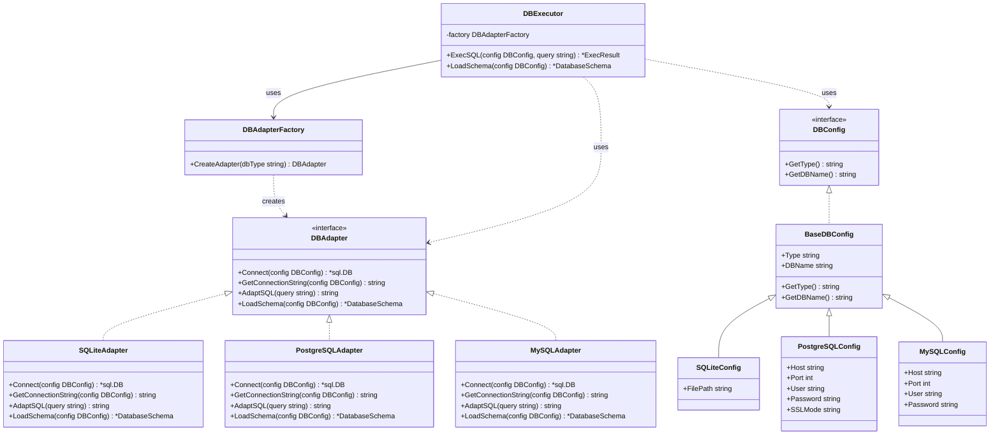

# 数据库适配层设计方案

## 1. 设计背景与目标

当前系统已经支持SQLite和PostgreSQL两种数据库，但随着需求扩展，未来还需要支持MySQL、TiDB等多种数据库源。目前的实现使用了条件判断来区分不同数据库，这种方式在支持的数据库类型增加时会变得难以维护。

**设计目标：**

1. 解耦各种数据库的具体实现
2. 提供统一的接口处理SQL查询和Schema加载
3. 轻松支持新增数据库类型
4. 优雅处理不同数据库间的SQL方言差异
5. 简化客户端代码，降低使用复杂度

## 2. 架构概览



## 3. 核心组件详解

### 3.1 接口定义

#### DBAdapter 接口

这是核心接口，定义了所有数据库适配器必须实现的功能：

```go
// DBAdapter 数据库适配器接口
type DBAdapter interface {
    // 连接相关方法
    Connect(config DBConfig) (*sql.DB, error)
    GetConnectionString(config DBConfig) string
    
    // SQL处理相关方法
    AdaptSQL(query string) string  // 处理SQL方言差异
    
    // Schema相关方法
    LoadSchema(config DBConfig) (*schema.DatabaseSchema, error)
}
```

#### DBConfig 接口

定义了数据库配置的必要信息：

```go
// DBConfig 数据库配置接口
type DBConfig interface {
    GetType() string  // 返回数据库类型
    GetDBName() string  // 返回数据库名称
}
```

### 3.2 配置结构

为不同数据库提供特定的配置结构：

```go
// 基础配置结构
type BaseDBConfig struct {
    Type   string  // 数据库类型
    DBName string  // 数据库名称
}

// SQLite特定配置
type SQLiteConfig struct {
    BaseDBConfig
    FilePath string  // 数据库文件路径
}

// PostgreSQL特定配置
type PostgreSQLConfig struct {
    BaseDBConfig
    Host     string
    Port     int
    User     string
    Password string
    SSLMode  string
}

// MySQL特定配置
type MySQLConfig struct {
    BaseDBConfig
    Host     string
    Port     int
    User     string
    Password string
}
```

### 3.3 工厂类

```go
// DBAdapterFactory 工厂类
type DBAdapterFactory struct {}

// 根据类型创建适配器
func (f *DBAdapterFactory) CreateAdapter(dbType string) DBAdapter {
    switch strings.ToLower(dbType) {
    case "sqlite":
        return &SQLiteAdapter{}
    case "postgres", "postgresql":
        return &PostgreSQLAdapter{}
    case "mysql":
        return &MySQLAdapter{}
    case "tidb":
        return &TiDBAdapter{}
    default:
        // 默认返回SQLite
        return &SQLiteAdapter{}
    }
}
```

### 3.4 执行器

提供统一的执行入口：

```go
// DBExecutor 数据库执行器
type DBExecutor struct {
    factory DBAdapterFactory
}

// 执行SQL
func (e *DBExecutor) ExecSQL(config DBConfig, query string) (*ExecResult, error) {
    // 获取适配器
    adapter := e.factory.CreateAdapter(config.GetType())
    
    // 调整SQL方言
    adaptedQuery := adapter.AdaptSQL(query)
    
    // 获取连接
    db, err := adapter.Connect(config)
    if err != nil {
        return nil, err
    }
    defer db.Close()
    
    // 执行查询并返回结果
    // ...
}
```

## 4. 设计模式解析

### 4.1 工厂模式 (Factory Pattern)

工厂模式用于创建对象，而无需暴露创建逻辑给客户端。在本设计中，`DBAdapterFactory`充当工厂，负责创建具体的适配器实例。

**优势：**
- 统一对象创建逻辑，集中管理
- 隐藏对象创建细节
- 便于扩展，添加新适配器只需修改工厂类

### 4.2 策略模式 (Strategy Pattern)

策略模式允许在运行时选择算法的行为。在本设计中，不同的`DBAdapter`实现代表不同的数据库操作策略。

**优势：**
- 将算法封装为独立的类
- 避免使用条件语句选择行为
- 使添加新策略更容易

### 4.3 适配器模式 (Adapter Pattern)

适配器模式允许不兼容的接口协同工作。在本设计中，各`DBAdapter`实现将不同数据库操作适配到统一接口。

**优势：**
- 统一各种数据库操作
- 隐藏底层差异
- 使系统更具弹性

### 4.4 组合模式 (Composition Pattern)

组合模式用于构建部分-整体层次结构。在本设计中，配置类使用组合而非继承，`BaseDBConfig`包含通用属性，具体配置类组合了这些通用属性并添加特定属性。

**优势：**
- 更灵活的结构
- 遵循"组合优于继承"原则
- 简化类层次结构

## 5. 使用示例

### 5.1 使用工厂创建配置

```go
// 从路径自动检测并创建适合的配置
func NewDBConfigFromPath(path string) DBConfig {
    // 分析路径并创建合适的配置
    if strings.HasPrefix(path, "postgres://") {
        // 返回PostgreSQL配置
    } else if strings.Contains(path, "mysql://") {
        // 返回MySQL配置
    } else {
        // 默认返回SQLite配置
    }
}
```

### 5.2 执行SQL查询

```go
// 创建执行器
executor := &DBExecutor{factory: DBAdapterFactory{}}

// 从路径创建配置
config := NewDBConfigFromPath(dbPath)

// 执行SQL
result, err := executor.ExecSQL(config, sqlQuery)
```

## 6. 扩展策略

### 6.1 添加新数据库支持

扩展支持新数据库的步骤：

1. 创建新的适配器实现 `DBAdapter` 接口
2. 创建新的配置结构体
3. 更新 `DBAdapterFactory` 以支持新的数据库类型

### 6.2 方言转换策略

每个适配器的 `AdaptSQL` 方法可以实现不同层次的SQL方言调整：

- **基本语法转换**：处理函数名差异、数据类型映射等
- **分页转换**：处理 LIMIT, OFFSET 语法差异
- **特殊功能转换**：处理序列、自增字段等特性

## 7. 迁移策略

由于现有系统已经有了一定的实现，建议采取渐进式迁移策略：

1. 首先创建适配器接口和基础结构
2. 实现SQLite和PostgreSQL适配器
3. 添加对应的配置类
4. 创建工厂和执行器
5. 更新现有代码，使用新的抽象层
6. 逐步添加新的数据库支持

## 8. 总结

本设计方案采用多种设计模式的组合，创建了一个灵活、可扩展的数据库适配层。该方案能够有效解耦各种数据库的具体实现，提供统一的接口，并且支持轻松添加新的数据库类型。

通过这种方式，系统能够更加优雅地处理SQL方言差异，简化客户端代码，并提高整体可维护性。在支持更多数据库（如MySQL、TiDB等）时，只需按照既定模式添加新的适配器和配置类，而无需修改现有代码。