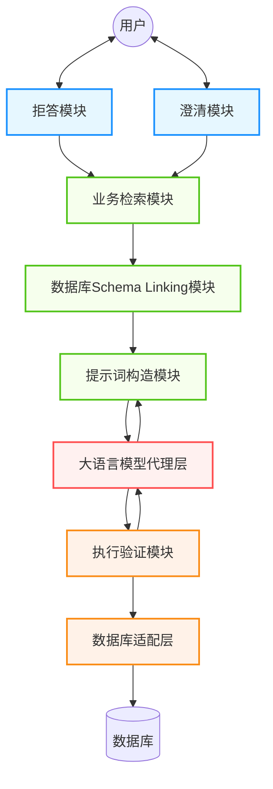
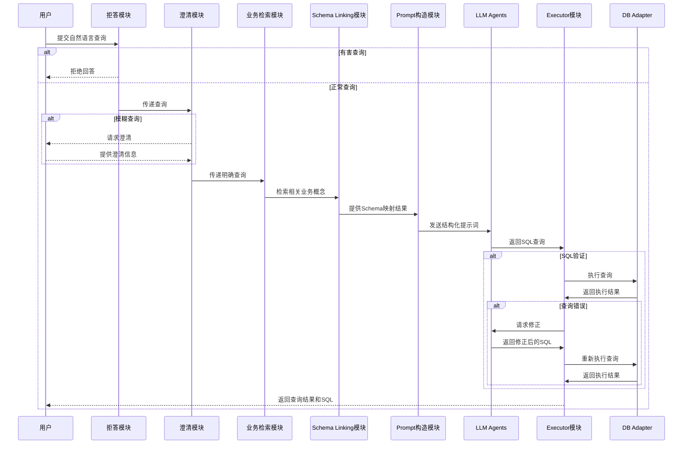

# Text-to-SQL 完整系统设计

## 1. 系统概述

Text-to-SQL 系统旨在将自然语言查询转换为结构化的 SQL 查询语句，使非技术用户能够便捷地与数据库交互。本设计文档提出了一个模块化、可扩展的系统架构，旨在解决 Text-to-SQL 任务中的各种挑战。

### 1.1 系统架构图

### 1.2 模块交互流程图

## 2. 核心模块说明

### 2.1 拒答模块

拒答模块是系统安全防护的第一道防线，负责识别并拒绝回答有害、敏感或不适当的查询。该模块采用多层防护策略，首先通过内容过滤器对输入查询进行实时扫描，检测其中的敏感词汇、有害内容或不适当请求。内容过滤器基于预定义的敏感词库和机器学习模型，能够识别包括但不限于恶意 SQL 注入尝试、数据泄露风险查询、以及违反业务规则的访问请求。拒绝策略管理器采用分级处理机制，根据查询的风险等级提供不同程度的拒绝响应，从温和的提醒到严格的访问阻止，确保用户体验的同时维护系统安全。安全日志记录器详细记录所有被拒绝的请求，包括查询内容、拒绝原因、用户信息和时间戳，这些数据不仅用于安全审计，还能为后续的模型优化和安全策略调整提供重要依据。

### 2.2 澄清模块

澄清模块作为用户意图理解的关键环节，专门处理模糊或不完整的查询请求。该模块集成了先进的自然语言处理技术，通过多维度的模糊性检测算法识别查询中的歧义表达、缺失信息和多义词汇。模糊性检测器运用语义分析、上下文理解和领域知识匹配等技术，能够准确定位查询中的不确定因素。当检测到模糊性时，澄清问题生成器会基于查询的具体情况和业务上下文，智能生成针对性的澄清问题。这些问题设计得既具体又易于理解，避免给用户造成困扰。用户反馈收集器采用对话式交互模式，支持多轮澄清对话，能够逐步收集和整合用户的澄清信息，直到获得足够清晰的查询意图。该模块还具备学习能力，通过分析历史澄清案例不断优化问题生成策略，提高澄清效率和用户满意度。

### 2.3 业务检索模块

业务检索模块是连接用户查询与企业业务逻辑的核心桥梁，负责将抽象的自然语言查询映射到具体的业务场景中。该模块维护一个综合性的业务知识库，涵盖企业的业务规则、专业术语、业务流程、数据字典和行业标准等丰富信息。知识库采用图数据库结构，通过实体关系网络描述复杂的业务关联，支持快速的语义检索和推理。语义匹配引擎集成了多种先进的自然语言处理技术，包括词向量匹配、语义相似度计算、实体识别和关系抽取等，能够准确理解查询中的业务概念并建立与知识库的映射关系。业务规则解释器采用规则引擎架构，支持灵活的业务逻辑配置和动态规则更新，确保生成的查询始终符合当前的业务要求和合规标准。该模块还提供业务术语标准化功能，将用户的日常用语转换为规范的业务术语，提高后续处理的准确性。

### 2.4 Schema Linking 模块

Schema Linking 模块承担着数据库结构理解和映射的关键任务，是实现精确 SQL 生成的技术基础。该模块首先通过 Schema 加载器动态获取目标数据库的完整结构信息，包括表结构、字段类型、约束关系、索引信息和统计数据等元信息。加载器支持多种数据库类型，能够处理复杂的数据库架构和动态 schema 变更。实体识别器采用命名实体识别(NER)和依存句法分析技术，从自然语言查询中精确识别表名、字段名、数值、日期等关键实体，并处理同义词、缩写和模糊匹配等复杂情况。映射器运用多重匹配策略，包括精确匹配、模糊匹配、语义匹配和上下文匹配，将识别的实体准确映射到数据库 schema 中的对应元素。该模块还集成了 schema 理解算法，能够推断表间关系、识别主外键约束，并基于数据分布和访问模式优化查询路径，为生成高效的 SQL 查询奠定坚实基础。

### 2.5 Prompt 构造模块

Prompt 构造模块是连接自然语言理解与大语言模型的关键接口，负责将多源信息整合为结构化的模型输入。该模块采用模板化设计，通过模板管理器维护针对不同查询类型、复杂度和业务场景的专用 prompt 模板。模板设计遵循最佳实践，包含清晰的任务描述、约束条件、输出格式要求和质量标准，确保模型能够产生高质量的结果。上下文整合器是该模块的核心组件，负责将用户查询、相关 schema 信息、业务规则、历史查询案例等多维信息有机融合到 prompt 中。整合过程采用智能筛选和优先级排序机制，确保关键信息得到突出展示，同时控制 prompt 的总长度在模型处理范围内。示例选择器运用相似度匹配和启发式算法，从历史查询库中选择最相关的示例作为 few-shot 学习的输入，这些示例不仅提供了任务模式的参考，还能引导模型生成更准确的 SQL 语句。该模块还具备动态优化能力，能够根据模型反馈和执行结果不断调整 prompt 策略。

### 2.6 Executor 模块

Executor 模块是系统的执行引擎，承担着 SQL 查询验证、执行和结果处理的核心职责。该模块首先通过 SQL 解析器对生成的 SQL 语句进行语法和语义分析，验证语句的正确性、安全性和可执行性。解析器集成了多种数据库方言的语法规则，能够检测语法错误、类型不匹配、权限违规等问题，并提供详细的错误诊断信息。查询执行器采用安全沙箱模式，通过权限控制、资源限制和超时机制确保查询执行的安全性。执行器支持事务管理、连接池复用和负载均衡，能够高效处理并发查询请求。结果验证器对查询结果进行多维度检验，包括数据完整性验证、业务逻辑一致性检查和异常结果检测，确保返回结果的准确性和可信度。该模块还集成了查询性能监控和优化建议功能，能够识别低效查询并提供优化建议。当检测到查询错误时，模块会启动自动修复机制，结合错误分析结果向 LLM 请求查询修正，实现智能化的错误处理和查询优化。

### 2.7 LLM Agents

LLM Agents 模块作为系统的智能核心，提供了与大语言模型交互的统一接口和管理能力。该模块通过模型适配器支持多种主流的大语言模型，包括 OpenAI GPT 系列、Google PaLM、Anthropic Claude 等，以及开源模型如 LLaMA、ChatGLM 等。适配器采用插件化架构，支持热插拔和动态切换，确保系统能够灵活应对不同的模型能力和成本要求。请求管理器实现了智能的请求路由和负载均衡，能够根据查询复杂度、模型能力和可用性动态选择最优的模型实例。该组件还集成了请求缓存、批处理优化和重试机制，显著提高了系统的响应速度和可靠性。结果解析器采用多模式解析策略，能够从模型的自由文本输出中准确提取 SQL 查询、置信度评分和解释信息，同时处理格式不规范、内容不完整等异常情况。该模块还提供了模型性能监控和质量评估功能，通过收集执行成功率、响应时间、结果准确性等指标，为模型选择和系统优化提供数据支持。

### 2.8 DB Adapter 数据适配层

DB Adapter 数据适配层是系统与异构数据库环境交互的统一抽象层，负责屏蔽不同数据库系统的差异并提供一致的数据访问体验。该模块通过数据库连接池实现高效的连接资源管理，采用动态伸缩策略根据系统负载自动调整连接数量，同时通过连接健康检查和故障恢复机制确保服务的高可用性。SQL 方言转换器是该模块的核心技术组件，集成了主流数据库系统的 SQL 方言规则，包括 MySQL、PostgreSQL、Oracle、SQL Server、SQLite 等，能够自动处理语法差异、函数映射、数据类型转换等复杂问题。转换器采用规则引擎和模式匹配技术，支持复杂查询的智能转换和优化。结果格式化器负责标准化不同数据库的返回结果，统一数据类型表示、null 值处理、编码格式等，为上层应用提供一致的数据接口。该模块还集成了性能监控和查询优化功能，能够收集查询执行统计信息，识别性能瓶颈，并提供针对性的优化建议。此外，模块还支持数据库元信息的动态发现和缓存，确保 schema 变更能够及时同步到系统中。
