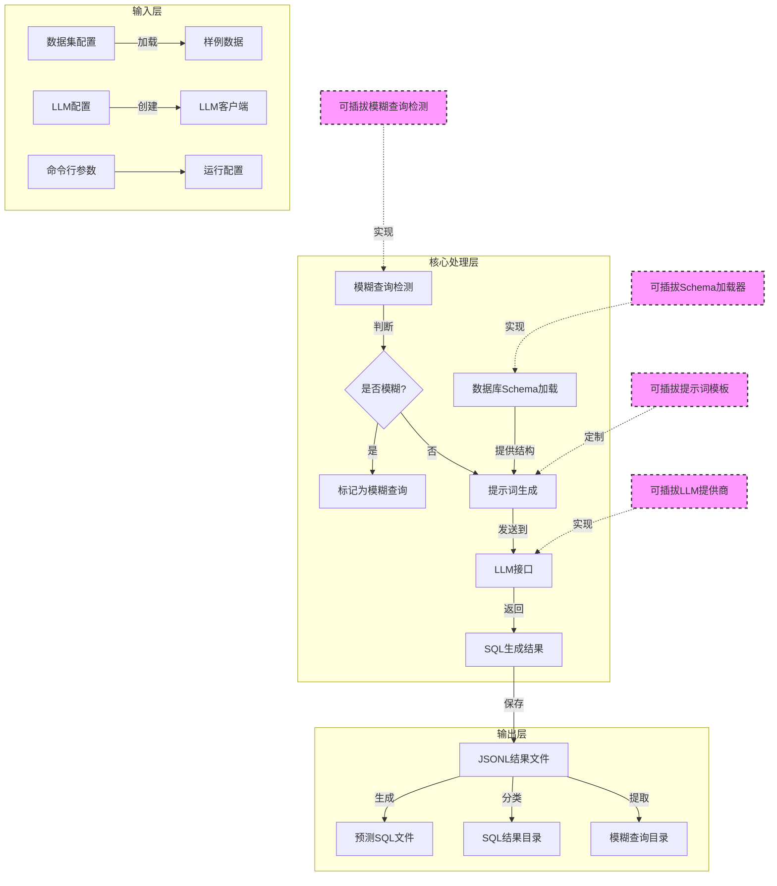
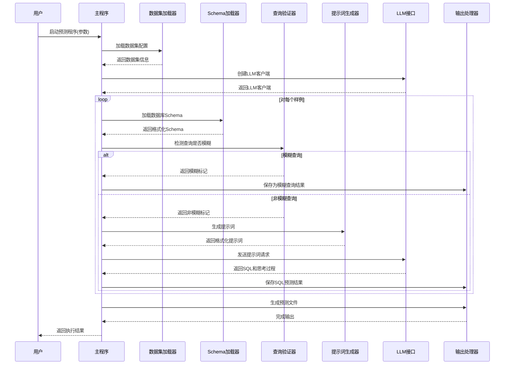
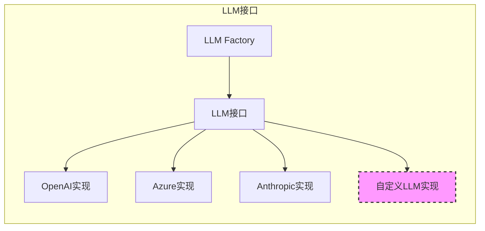
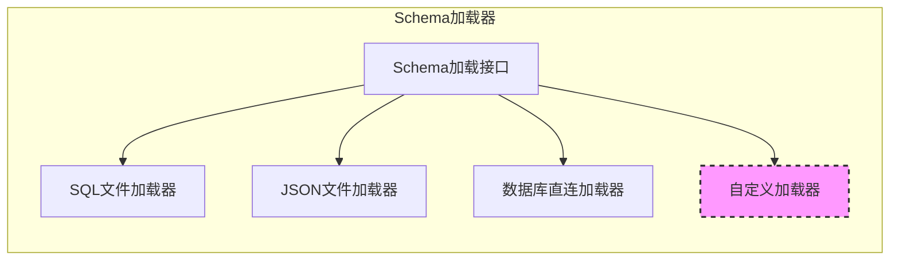
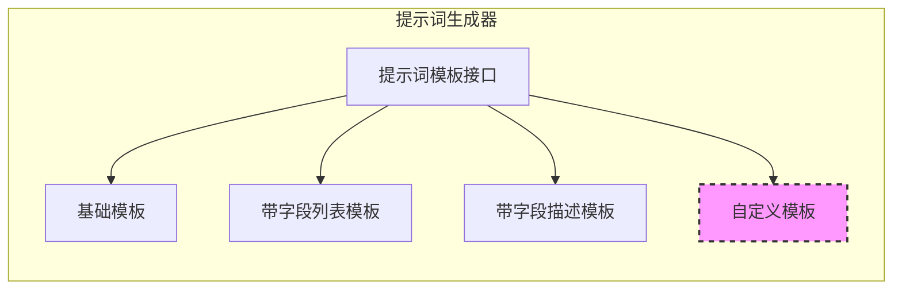
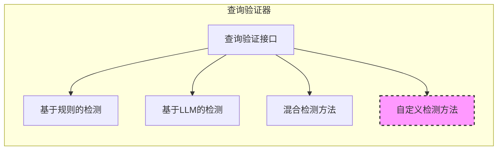
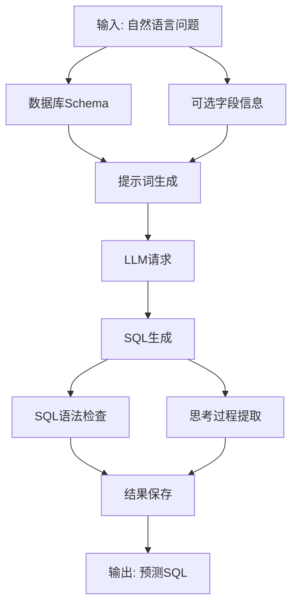

# Text2SQL 预测管线架构

## 1. 架构图

## 2. 泳道图

## 3. 可插拔组件详解

### 3.1 可插拔的LLM提供商

### 3.2 可插拔的Schema加载器

### 3.3 可插拔的提示词模板

### 3.4 可插拔的模糊查询检测

## 4. 预测管线数据流

## 5. 预测管线设计原则

1. **模块化设计**: 每个组件都有明确的职责和接口，便于替换和升级
2. **可插拔架构**: 核心组件都支持多种实现，可以根据需要进行替换
3. **扩展性**: 支持添加新的LLM提供商、Schema加载方式和提示词模板
4. **可配置性**: 通过命令行参数和配置文件控制行为，无需修改代码
5. **结果可追溯**: 保存完整的输入、输出和中间思考过程，便于分析和调试

## 6. 支持的实验特性

1. **多种LLM模型**: 支持OpenAI、Azure、Anthropic等多种模型
2. **字段信息增强**: 可选择性地提供结果字段列表或描述，提升SQL生成准确性
3. **模糊查询检测**: 自动识别需要澄清的模糊问题，避免生成错误SQL
4. **思考过程提取**: 记录LLM的推理过程，便于分析和改进
5. **多种数据库方言**: 支持SQLite和PostgreSQL等多种SQL方言
6. **自定义提示词模板**: 可以根据不同模型和任务定制提示词格式