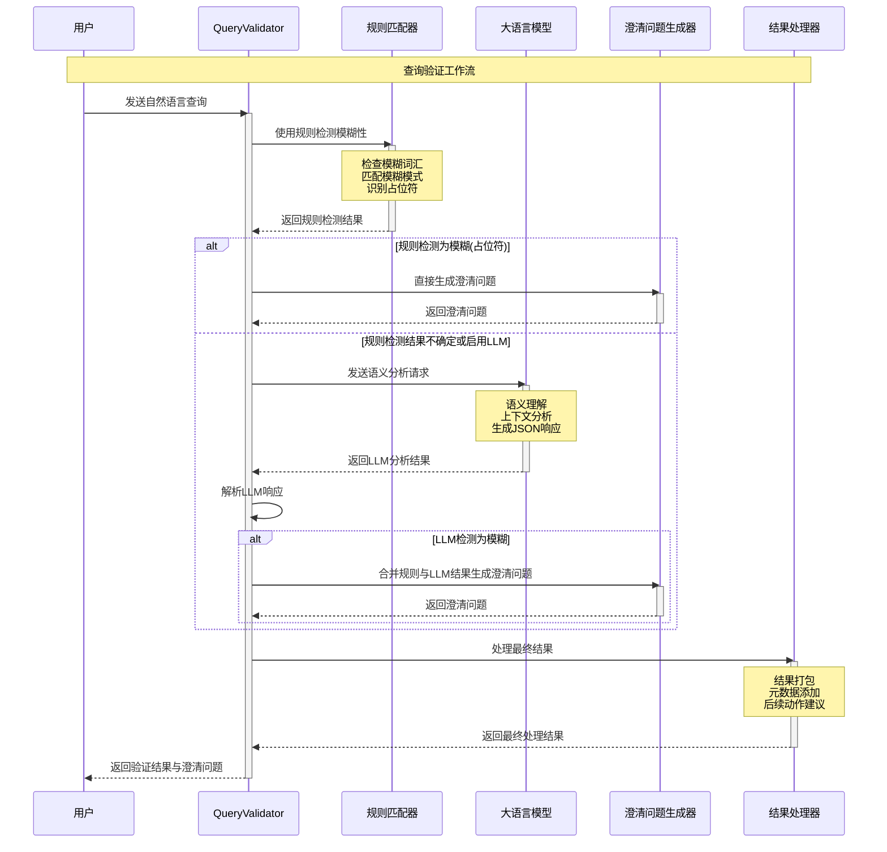
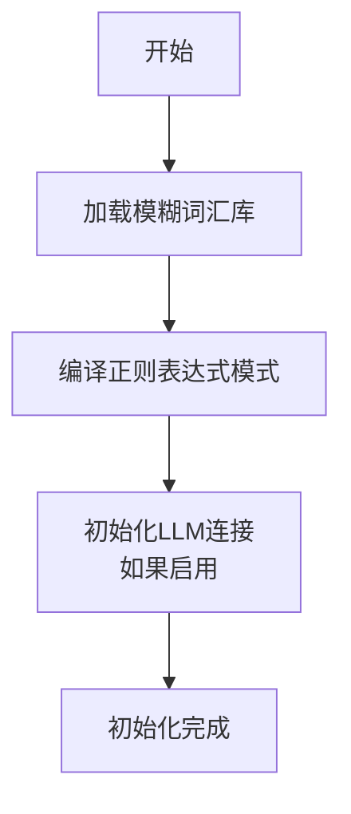
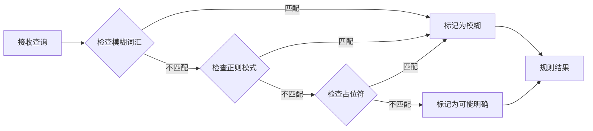
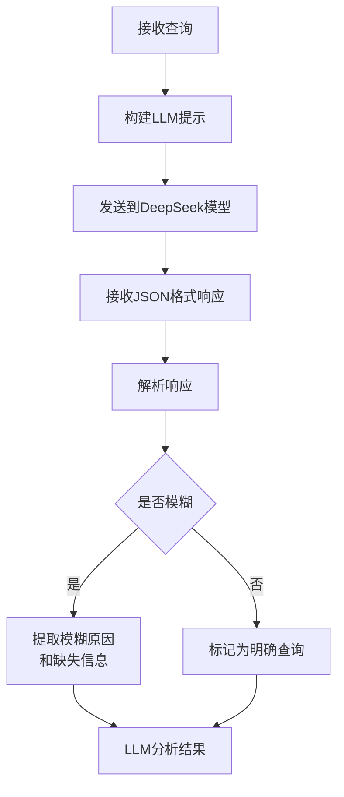
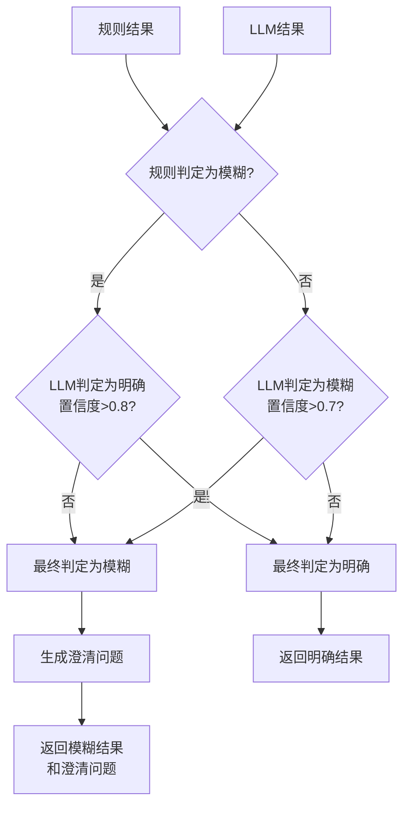
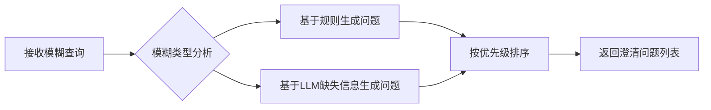
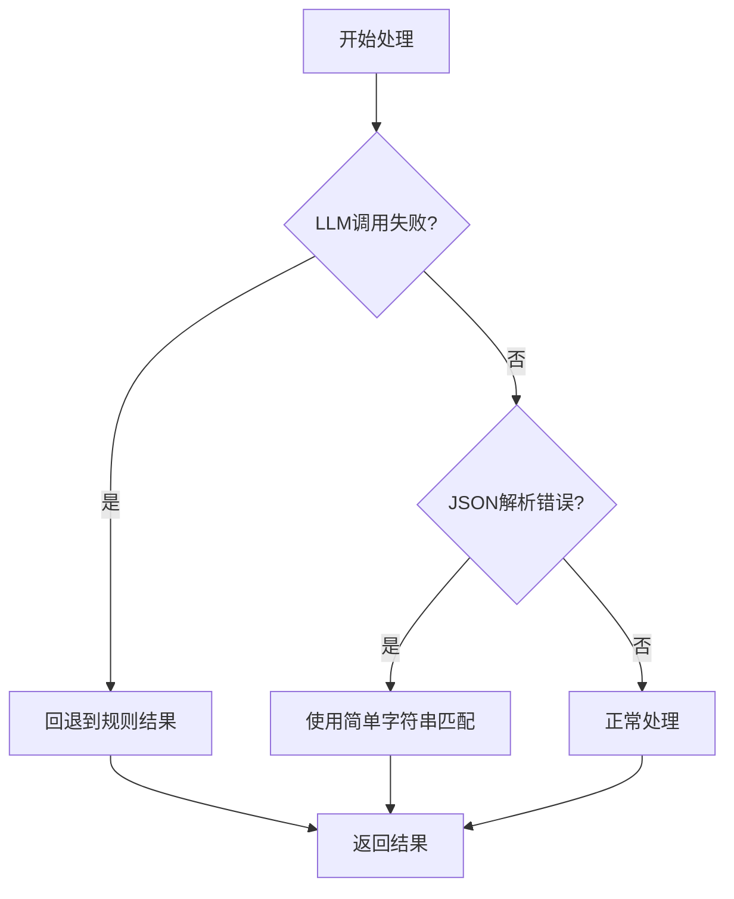

## 查询验证器工作管线

> 查询验证器(QueryValidator)是一个混合规则与LLM能力的智能组件，旨在识别模糊查询并生成澄清问题，确保系统能够理解用户的真实查询意图。它通过规则匹配与语义分析的双重验证，实现了高准确度的模糊查询检测。

## 工作流程概述

> 查询验证器采用多阶段处理流程，包括初始规则检测、LLM语义分析和结果融合，确保对模糊查询的全面识别，同时能为识别到的模糊查询生成针对性的澄清问题。

### 泳道图表示

## 详细处理阶段

### 1. 初始化阶段

> 查询验证器初始化时配置了规则匹配器和可选的LLM客户端，为后续处理奠定基础。

### 2. 规则匹配阶段

> 规则匹配阶段通过预定义的模式快速筛选明显的模糊查询，提供高效的一级过滤。

### 3. LLM分析阶段

> LLM分析阶段利用大语言模型的语义理解能力进行深度分析，特别是对于规则无法确定的情况，提供更加智能的判断。

### 4. 结果融合阶段

> 结果融合阶段综合规则和LLM的判断，依据置信度和特定规则进行权衡，确保最终结果的可靠性。

### 5. 澄清问题生成阶段

> 澄清问题生成阶段针对不同类型的模糊性创建有针对性的问题，帮助用户提供更明确的信息。

## 实现细节

### 规则匹配部分

规则匹配系统主要由以下组件构成：
- 模糊词汇库：包含"特定"、"某个"等表示不明确的词汇
- 正则表达式模式：匹配占位符、ID模式等结构化模式
- 占位符检测：识别明显的占位符如"[请输入]"、"..."等

### LLM集成部分

LLM集成通过以下方式实现：
- 构建结构化提示：指导LLM以JSON格式返回分析结果
- 响应解析：从LLM响应中提取JSON部分并转换为结构化数据
- 置信度评估：利用LLM返回的置信度进行结果权衡

### 澄清问题生成部分

澄清问题生成遵循以下原则：
- 针对性：基于模糊性类型生成相关问题
- 优先级：为不同类型的问题分配优先级
- 组合能力：能够同时使用规则生成和LLM生成的问题

## 异常处理机制

## 未来改进方向

1. **模糊性评分系统**：为查询添加更细粒度的模糊性评分
2. **上下文感知**：考虑用户历史查询作为判断依据
3. **预训练优化**：针对特定领域训练LLM提高准确性
4. **反馈学习**：从用户反馈中学习，持续改进判断能力
