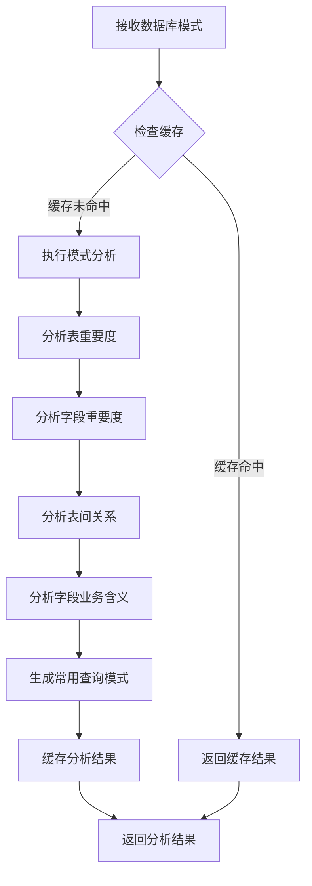

# SchemaAnalyzer（模式分析器）设计文档

> SchemaAnalyzer是一个专注于数据库模式分析的智能组件，能够理解表结构、字段关系和业务含义，为后续查询处理提供关键的数据上下文信息。它采用多维度分析方法，为数据库中的表和字段分配重要度权重，识别表间关联，并推断出字段的业务含义。

## 功能概述

> SchemaAnalyzer通过分析数据库模式结构，提取表和字段的重要度、表间关系、字段业务含义和常用查询模式，为查询生成和字段对齐提供基础支持。

### 核心功能

1. **表重要度分析** - 根据表结构特征为表分配重要度权重
2. **字段重要度分析** - 根据字段用途和特征为字段分配重要度权重
3. **表间关系识别** - 识别和分类表之间的关联关系
4. **字段业务含义推断** - 基于命名规则推断字段的业务含义
5. **查询模式生成** - 根据表结构生成常见的查询模式

## 设计结构

### SchemaAnalyzer结构

```go
type SchemaAnalyzer struct {
    // 缓存分析过的表结构信息
    analyzedSchemas map[string]*SchemaAnalysis
}

type SchemaAnalysis struct {
    // 表的重要度评分 (0-1)
    TableImportance map[string]float64
    // 字段的重要度评分 (0-1)
    FieldImportance map[string]map[string]float64
    // 表之间的关系
    TableRelations []TableRelation
    // 字段的业务含义描述
    FieldDescriptions map[string]map[string]string
    // 常用查询模式
    CommonQueryPatterns []string
}

type TableRelation struct {
    SourceTable      string
    SourceField      string
    TargetTable      string
    TargetField      string
    RelationType     string // "one-to-one", "one-to-many", "many-to-many"
    RelationStrength float64 // 关系强度 (0-1)
}
```

## 工作流程

> SchemaAnalyzer接收数据库模式定义，经过多阶段分析处理，生成结构化的模式分析结果，为查询处理和字段对齐提供基础支持。



## 分析方法

### 表重要度分析

> 表重要度分析基于表的结构特征和作用，为不同表分配相对重要性权重，帮助查询生成时做出更优先级决策。

分析因素：
- 表中字段的数量和类型
- 是否包含ID、时间戳等关键字段
- 在关系图中的中心度
- 表名称中的关键词

### 字段重要度分析

> 字段重要度分析识别每个表中最关键的字段，为后续的查询和分析提供优先级参考。

分析因素：
- 是否为主键或外键
- 字段名称中的关键词（ID、名称、日期等）
- 数据类型和约束条件

### 表间关系识别

> 表间关系识别发现并分类表之间的关联，构建数据库的关系图，为多表查询提供路径支持。

识别方法：
- 基于外键定义的显式关系
- 基于命名约定的隐式关系
- 关系类型判断（一对一、一对多、多对多）
- 关系强度评估

### 字段业务含义推断

> 字段业务含义推断通过规则和模式识别，为字段添加业务上下文描述，增强语义理解能力。

推断规则：
- 基于字段名称中的关键词（name、date、status等）
- 基于表名和字段名的组合语义
- 基于字段类型和约束的功能推断

### 查询模式生成

> 查询模式生成根据表结构和关系，预生成常见的查询模式，为查询生成提供模板参考。

生成模式：
- 单表全字段查询
- 基于主键的条件查询
- 基于关联关系的多表联接查询
- 基于时间字段的范围查询

## 与其他Agent的交互

1. **与QueryValidator的交互**
   - 提供表字段信息，帮助验证查询中的表和字段是否存在

2. **与FieldAligner的交互**
   - 提供字段业务含义和关系信息，支持字段对齐

3. **与BusinessInfo的交互**
   - 提供表间关系和字段重要度，帮助理解业务上下文

## 缓存策略

> SchemaAnalyzer使用缓存机制避免重复分析相同的数据库模式，提高系统效率。

缓存要点：
- 使用表结构签名作为缓存键
- 在数据库结构变化时失效缓存
- 支持强制刷新缓存的选项

## 未来扩展

1. **基于数据样本的分析**
   - 通过分析实际数据分布增强模式理解

2. **机器学习增强**
   - 使用ML技术学习字段间关系和业务规则

3. **交互式反馈优化**
   - 根据用户反馈调整分析结果

4. **高级语义网络**
   - 构建表和字段的语义网络，支持更复杂的关联分析
